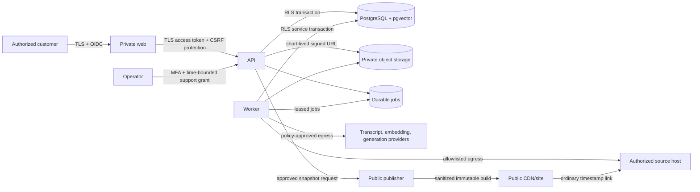

# Video Library Indexing Service — technical product requirements document

Status: implementation candidate

Version: 1.0

Date: 2026-09-01

Product owner: Tyler Koster

Technical authority: Receipt Portfolio coordinator

Implementation authority: not granted by this document; approve this PRD before execution

Supersedes: no prior technical PRD
Business strategy: `docs/product/2026-09-01-video-library-service-strategy.md`

## 1. Purpose and governing decision

This document is the implementation-grade contract for a managed service that
turns an owner-authorized video library into a private, searchable,
citation-ready knowledge asset and, when explicitly approved, a public
discovery surface. It is intended to function as a development dry run: product
behavior, architecture, data, interfaces, states, failure handling, security,
privacy, rights, quality gates, operations, rollout, and commercial pilot
requirements are decided here before feature implementation begins.

The product is not a generic SEO blog, video host, clipping tool, transcript
scraper, or ungrounded chatbot. Its promise is:

> We index your authorized video library so your team can retrieve what was
> said, understand where it came from, open the exact source moment, and—when
> you approve it—make selected knowledge discoverable on the web.

The service owns authorized metadata, transcript derivatives, moment records,
retrieval, grounding, governance, public-page generation, synchronization, and
measurement. Original video bytes remain on the customer's existing host in
the first release. AI Moment Index remains the public proof and becomes the
first public publisher implementation, not the private service itself.

### 1.1 Decision hierarchy

When requirements conflict, use this order:

1. Lawful authority, contractual restrictions, speaker rights, and verified
   deletion.
2. Tenant isolation, privacy, security, and customer trust.
3. Source fidelity, citation integrity, correction, and abstention.
4. Customer task completion and maintainability.
5. Performance and cost.
6. Public discovery and growth.
7. Visual polish.

No growth, SEO, AI, or revenue experiment may weaken items 1–4.

## 2. Product outcomes, non-goals, and truth boundaries

### 2.1 Required outcomes

The first paid pilot must allow an authorized customer to:

1. create a tenant and invite a bounded team;
2. complete and approve an authority/data-processing profile;
3. connect one authorized YouTube library or upload a manifest plus authorized
   transcript/caption files;
4. ingest 50–500 already-public long-form videos without rehosting media;
5. inspect ingestion, rights, transcript, and source-version state;
6. search the private library by phrase, concept, speaker, topic, date, source,
   and status;
7. ask a question and receive a supported answer with exact source moments, or
   an explicit abstention;
8. open the source video at the stored timestamp;
9. approve, correct, supersede, remove, revoke, or keep private any generated
   moment or public artifact;
10. if the order includes the public add-on, publish only explicitly approved
    watch, moment, topic, collection, and search surfaces;
11. export selected moments for writing, editing, support, sales enablement, or
    training;
12. propagate source removal, revocation, correction, and customer deletion to
    every derivative, index, cache, export, and public page;
13. view truthful quality, usage, reuse, source-health, and maintenance reports;
14. complete export and termination without lock-in.

### 2.2 Explicit non-goals for the pilot

- Primary video hosting, streaming, transcoding, or CDN delivery.
- Arbitrary third-party YouTube transcript collection or scraping.
- Raw-footage media asset management, editing proxy storage, or EDL generation.
- Automatic public publication without human approval.
- Fully autonomous legal or copyright determinations.
- Guaranteed search-engine ranking, AI citation, traffic, lead volume, or
  revenue.
- Real-time transcription, live-event search, face recognition, emotion
  inference, speaker identity inference, biometric indexing, or voice cloning.
- General enterprise LMS, DAM, CMS, or meeting-recording replacement.
- Customer-facing self-service billing in the first five paid pilots.
- Training foundation models on customer content.

### 2.3 Claims the product may and may not make

The product may claim a source was fetched, hashed, parsed, indexed, reviewed,
or published only when the corresponding immutable evidence exists. It may say
a result matches indexed content and route to a stored timestamp. It may not
claim that a source is true, safe, endorsed, current, owned, licensed for every
use, or commercially effective merely because field validation or retrieval
passed. Synthetic tests, deterministic fixtures, source availability, crawler
health, and indexed-page counts are not user demand or revenue evidence.

## 3. Customer, users, jobs, and roles

### 3.1 Initial customer profile

The first beachhead is a B2B webinar publisher—not a general podcast or creator
market. The economic buyer is the Head of Content or Demand Generation; the
operational owner is the content operations/editorial lead. The qualifying
customer has 50–500 already-public long-form webinar recordings, publishes at
least monthly, has an existing lead-generation or customer-education funnel,
repeatedly needs to recover prior expert explanations, and can establish
authority over the selected library. Expert creators and podcast publishers are
adjacent prospects only after one webinar pilot renews. Agencies, private
footage libraries, and enterprise learning libraries are later segments because
they add client-rights chains, inherited ACLs, storage catalogs, and
editing-system requirements.

The initial recruitment path is five to ten opt-in design-partner conversations
from the product owner's existing professional network, referrals, or inbound
interest. No automated scraping, impersonation, unsolicited bulk outreach, or
paid acquisition is part of the product build. Any outbound campaign requires a
separate approved sales process and truthful sender identity.

### 3.2 Primary jobs to be done

| User                 | Job                                                                   | Present pain                                        | Success evidence                                            |
| -------------------- | --------------------------------------------------------------------- | --------------------------------------------------- | ----------------------------------------------------------- |
| Creator/publisher    | Find where a topic was explained before                               | Memory, titles, and platform search are unreliable  | Exact reusable moment found in under two minutes            |
| Content lead         | Reuse the archive for articles, clips, newsletters, and answers       | Review requires replaying long videos               | Approved export includes quote/context/source/time          |
| Sales/support lead   | Locate a defensible answer from the founder or subject expert         | Knowledge is trapped in video                       | Cited answer opens the exact source moment                  |
| Library steward      | Know what is current, corrected, private, removed, or unsafe to reuse | Source state drifts silently                        | Health queue is current and actionable                      |
| Publisher/SEO lead   | Create useful, source-bound public pages                              | Thin transcript pages are risky and unhelpful       | Approved pages are unique, useful, canonical, and linked    |
| Rights/privacy owner | Control who may process and publish each asset                        | Channel access is mistaken for universal permission | Every derivative is covered by explicit scopes              |
| Service operator     | Ingest, diagnose, correct, and report without unsafe shortcuts        | One-off scripts are hard to audit                   | Jobs are idempotent, observable, recoverable, and receipted |

### 3.3 Application roles and permissions

Roles are tenant-scoped. A platform operator cannot silently assume a customer
role; support elevation requires a time-bounded, reason-coded, customer-visible
grant.

| Capability                | Tenant owner |       Rights admin |  Editor/reviewer | Viewer | Billing contact |     Support operator |
| ------------------------- | -----------: | -----------------: | ---------------: | -----: | --------------: | -------------------: |
| Manage tenant/security    |          Yes |                 No |               No |     No |              No |     Break-glass only |
| Invite/remove users       |          Yes |                 No |               No |     No |              No |                   No |
| Approve authority profile |          Yes |                Yes |               No |     No |              No |                   No |
| Add/revoke connector      |          Yes |                Yes |               No |     No |              No |   Assisted, explicit |
| View private library      |          Yes |                Yes |              Yes |    Yes |              No |   Time-bounded grant |
| Search/ask questions      |          Yes |                Yes |              Yes |    Yes |              No |   Time-bounded grant |
| Correct moment metadata   |          Yes |                Yes |              Yes |     No |              No |   Assisted, explicit |
| Approve public output     |          Yes |                Yes | Yes if delegated |     No |              No |                   No |
| Delete/export tenant data |          Yes | Rights co-approval |               No |     No |              No | Execute approved job |
| View billing              |          Yes |                 No |               No |     No |             Yes |                   No |
| View audit trail          |          Yes |                Yes | Read own actions |     No |              No |  Own support actions |

High-impact actions—connector grant, public publication, authority changes,
bulk export, and deletion—require recent reauthentication. Tenant deletion and
rights-scope expansion require owner plus rights-admin approval; for a
single-person tenant, a 24-hour reversible hold substitutes for dual approval.

## 4. Current system and reuse decision

The repository is a Node 24/TypeScript monorepo that emits deterministic static
sites to GitHub Pages. It has no authenticated runtime, tenant database,
background worker, private object store, or account system. The service must
not disguise those absences behind browser-only state.

### 4.1 Reuse without redesign

- Exact timestamp URL semantics, deterministic fixture search behavior, and
  benchmark cases from `packages/video-moment-core` are reusable as regression
  oracles. The package itself requires extraction/hardening described below.
- `sites/video-moment-search/source-evidence.ts`: fail-closed source and rights
  evidence patterns.
- `sites/video-moment-search/seo.ts`: canonical page, sitemap, feed, discovery
  eligibility, and uniqueness patterns.
- `sites/video-moment-search/render.ts` and the current public route suite:
  approved static publishing proof.
- `packages/evidence-core`: allowlisted manifests, canonical JSON, hashes,
  receipts, policy evaluation, and mutation detection.
- Search Receipt: source-health, correction, drift, and immutable receipt
  patterns.
- SkillLedger: exact source designation, license/reference allowlists,
  no-execution boundaries, and public/private admission patterns.
- Workflow Test Lab: negative constraints, deterministic fixtures, mutation
  testing, and query-to-timestamp regression scenarios.

### 4.2 Reuse after extraction or hardening

- The current `VideoCorpus` is a publication fixture, not the service database
  schema. Preserve its semantic invariants behind versioned adapters.
- Split the current aggregate validator into pure authority, source, transcript,
  moment, correction, and publication policies; inject an explicit validation
  clock instead of ambient time. Generalize Wikimedia-only evidence and remove
  duplicated client ranking/evidence logic before service reuse.
- Current lexical ranking becomes a deterministic baseline and fallback, not
  the final relevance engine.
- Current measurement events are allowlisted and intentionally non-delivering;
  replace the sink only after privacy approval while retaining field allowlists.
- Current publisher remains the public static rendering engine, but it must
  consume an approved publication snapshot rather than private operational
  tables.

### 4.3 Do not reuse as service infrastructure

- GitHub Pages for authenticated/private application delivery.
- Git-tracked JSON as the customer database or job queue.
- Browser fragments as the only saved-search mechanism.
- Build-time fixture collection as recurring customer ingestion.
- Public source evidence as a substitute for a customer authority contract.

## 5. Chosen architecture

### 5.1 Architectural style

Use a modular monolith with separately deployable web, API, worker, and public
publisher processes. This is simpler to operate than microservices during the
pilot while preserving clear module boundaries and asynchronous jobs. Do not
split services until measured scale, independent release cadence, or security
isolation justifies it.

Technology decisions:

- Runtime: Node.js 24 and strict TypeScript.
- Private web application: React + Vite, WCAG 2.2 AA target.
- API: Fastify with TypeBox/JSON Schema request and response validation and an
  generated OpenAPI 3.1 contract.
- System of record: managed PostgreSQL 17 with row-level security and pgvector.
- Migrations: checked-in, forward-only SQL with transactional expand/contract
  migrations; destructive cleanup occurs only after rollback window expiry.
- Object storage: private S3-compatible encrypted bucket for authorized source
  snapshots, transcript files, export packages, and evidence documents. No
  original media bytes in pilot scope.
- Job queue: PostgreSQL-backed durable queue in the pilot; leases,
  idempotency keys, dead-letter state, and concurrency limits are mandatory.
  Add a separate broker only when measured queue contention requires it.
- Search: PostgreSQL full-text plus pgvector hybrid retrieval, deterministic
  fusion, and optional reranking behind a provider-neutral adapter.
- Transcription/embeddings/generation: purchased provider adapters; no model
  training. Provider choice is tenant-policy aware and every external egress is
  recorded.
- Authentication: OIDC provider with passkey/WebAuthn and TOTP recovery support.
  Owners, rights admins, and operators enroll phishing-resistant MFA before
  privileged access; viewers/editors enroll on first sensitive action. Email
  magic links are single-use 15-minute invitation/bootstrap tokens only, not a
  standing MFA substitute. Recovery uses verified OIDC account recovery plus
  owner/admin reapproval; a single-owner tenant enters the 24-hour hold.
  Application authorization remains in the service database, never in
  client-supplied claims alone.
- Secrets: cloud secret manager; never repository, database plaintext, logs,
  analytics, or browser storage.
- Public publisher: existing deterministic static generator, deployed from a
  sanitized publication snapshot to CDN/static hosting.
- Observability: OpenTelemetry traces/metrics, structured JSON logs, error
  tracking, and database-backed immutable audit events.
- Infrastructure: infrastructure as code; separate development, staging, and
  production accounts/projects and credentials.

The reference production topology is one U.S. region selected in the signed
data-processing agreement, with multi-availability-zone managed PostgreSQL,
versioned private object storage, KMS-backed keys, private worker networking,
containerized API/worker compute, CDN/WAF for web and public artifacts, and
managed DNS/certificates. Vendor names remain procurement substitutions rather
than domain dependencies. Before the first customer, the architecture decision
record must name the exact vendors, region, subprocessors, DPA, backup location,
support access, deletion mechanism, and monthly budget. The service does not
deploy customer data to a vendor that has not passed that gate.

React, Fastify, PostgreSQL, pgvector, and a managed OIDC provider are explicit
defaults, not open selections. A provider may change during procurement only
if the replacement passes the same portability, residency, deletion, security,
and cost requirements.

### 5.2 Deployment units

| Unit                         | Responsibility                                                | Network exposure                                            | Scaling                     |
| ---------------------------- | ------------------------------------------------------------- | ----------------------------------------------------------- | --------------------------- |
| `apps/private-web`           | Authenticated customer and operator UI                        | Public HTTPS through CDN/WAF                                | Static assets independently |
| `apps/api`                   | Auth, tenancy, command/query API, signed upload/download URLs | Public HTTPS; authenticated except health and OIDC callback | Horizontal; stateless       |
| `apps/worker`                | Ingestion, transcription, indexing, drift, deletion, exports  | No public ingress                                           | Queue depth/concurrency     |
| `apps/public-publisher`      | Build sanitized approved public artifacts                     | CI/job only                                                 | Per publication snapshot    |
| `packages/domain`            | Domain models, state machines, policies                       | In-process                                                  | N/A                         |
| `packages/connectors`        | Source-provider adapters                                      | Worker egress only                                          | Per provider limits         |
| `packages/retrieval`         | Indexing, hybrid search, grounding evaluation                 | API/worker in-process                                       | Extract later if necessary  |
| `packages/evidence-core`     | Existing evidence primitives                                  | In-process                                                  | N/A                         |
| `packages/video-moment-core` | Existing exact-moment/public corpus primitives                | In-process                                                  | N/A                         |

### 5.3 Context and trust boundaries



Trust boundaries are: browser/API; tenant/application; worker/external source;
worker/model processor; private/public publication; operator/customer; and
production/non-production. Data does not cross a boundary without a policy
decision, audit event, and least-privilege credential.

## 6. End-to-end data flow

### 6.1 Ingestion happy path

1. Tenant owner creates a library and selects its privacy/publication defaults.
2. Rights admin completes the authority profile and approves named processors.
3. Owner connects an OAuth-authorized YouTube account or uploads an import
   manifest with authorized VTT/SRT/plain-text transcript files.
4. API validates request shape, permission, idempotency key, quota, source
   designation, and authority prerequisites.
5. API records an immutable command and enqueues `source.sync.requested`.
6. Worker obtains a lease, refreshes a connector token only in the secret
   boundary, and enumerates authorized source assets.
7. Each source response is allowlisted, size-limited, content-type checked,
   hashed, stored as an immutable source snapshot, and receipted.
8. The worker reconciles source identities and versions without overwriting the
   previous version.
9. An authorized existing caption is normalized. If absent and the authority
   profile permits it, a transcription provider receives only a
   customer-controlled, rights-admitted object or temporary signed input. A
   YouTube watch/embed/delivery URL is never a transcription input. Provider,
   model, region, terms, request ID, and deletion status are recorded.
10. Transcript segments are time-aligned, normalized, hashed, and checked for
    duration/timestamp consistency.
11. Candidate moments are generated from transcript segments and source
    metadata. They remain private and `draft`.
12. Lexical and semantic index documents are built transactionally from the
    admitted version. The previous active index stays available until commit.
13. Quality checks run: coverage, timestamp bounds, duplicate rate, language,
    empty content, prompt-injection markers, source version, and benchmark.
14. Asset enters `ready_for_review`, `ready`, or `quarantined`; the user sees a
    specific explanation and corrective action.

### 6.2 Search and cited-answer path

1. User submits a query over selected libraries and allowed filters.
2. API resolves tenant, user, role, library ACL, policy, and query budget.
3. Query is normalized without logging raw text by default.
4. Lexical and semantic candidates are retrieved only from active, authorized,
   non-deleted versions visible to the user.
5. Reciprocal-rank fusion combines candidate sets; deterministic business
   filters apply currentness, review state, visibility, and source authority.
6. Optional reranking receives the minimum required excerpts and may be
   disabled per tenant.
7. Exact search returns ranked moments with source, version, timestamp, context,
   review state, and why-it-matched signals.
8. For question answering, a separate grounding stage builds a claim plan from
   the admitted excerpts. Every factual answer span must map to at least one
   evidence span; unsupported or contradictory claims are removed.
9. If coverage or confidence is below threshold, the system returns a scoped
   abstention and the best source moments, never a confident unsupported answer.
10. Response contains no data from a different tenant, inaccessible library,
    deleted version, or non-approved public derivative.

### 6.3 Publication path

1. Reviewer selects one or more private moments and chooses `approve_public`.
2. Service shows the exact proposed title, description, excerpt, context,
   source link, timestamp, canonical route, metadata, and processor disclosures.
3. Rights/publication policy re-evaluates current authority; stale approvals
   fail closed.
4. Dual approval is required when the authority profile marks guest, likeness,
   confidential, regulated, or customer-data sensitivity.
5. A sanitized immutable publication snapshot is created. It contains no
   private transcript, search queries, internal notes, connector tokens, user
   identity, or unapproved derived fields.
6. Existing deterministic publisher validates uniqueness, usefulness, source
   evidence, currentness, correction state, and exact timestamp routing.
7. Staging build runs accessibility, structured-data, link, security-header,
   sitemap, feed, and browser checks.
8. Production deployment is atomic. Public health checks verify route, index
   membership, source target, stored timestamp, and removal behavior.

### 6.4 Correction, revocation, and deletion path

1. Source sync, user action, provider notice, or support action creates a
   reason-coded change event.
2. Affected source version becomes `superseded`, `revoked`, `removed`, or
   `deletion_pending`; it is excluded from new reads immediately.
3. Related moments, embeddings, answer cache entries, exports, saved results,
   publication snapshots, public routes, feeds, and sitemaps are invalidated by
   lineage, not keyword search.
4. Public removal deploys ahead of lower-priority rebuilds. Static customer and
   proof hosts return validated `404` after removal; a future edge host may use
   `410` only after an integration test proves that status. Corrected routes may
   redirect only when a safe canonical replacement exists.
5. Worker deletes provider-side copies, object-store versions, vectors, and
   operational rows according to the deletion plan. Legal hold pauses physical
   deletion but immediately blocks use and records its authority.
6. Backups age out under the documented cryptographic-erasure/retention window.
7. Verification job proves absence from every active surface and records a
   deletion receipt. Failures remain visible and retry; the system never marks
   deletion complete from request acceptance alone.

## 7. Domain model and invariants

All identifiers are opaque UUIDv7 values. Human slugs are mutable presentation
fields and never foreign keys. All timestamps are UTC ISO 8601 with database
`timestamptz`. Every mutable row has `created_at`, `updated_at`, `version`, and
`tenant_id`; all commands use optimistic concurrency through `version` or
ETags. Hashes are lowercase SHA-256 unless a stronger algorithm is versioned.

### 7.1 Core records

#### Tenant

`id`, `name`, `slug`, `status`, `plan_id`, `region`, `default_privacy`,
`query_retention_mode`, `data_retention_days`, `deletion_grace_hours`,
`created_at`, `suspended_at`, `closed_at`.

Statuses: `provisioning`, `active`, `suspended`, `termination_pending`,
`deleting`, `deleted`. Only `active` permits new ingestion or publication.

#### User and membership

User: `id`, `email_normalized`, `display_name`, `status`, `created_at`,
`updated_at`, `version`. External identity: `id`, `user_id`, `issuer`,
`audience`, `subject_digest`, `provider`, `mfa_state`, `last_authenticated_at`,
`created_at`, `updated_at`, `version`. The subject digest is a versioned HMAC
over issuer, audience, and subject; email equality never links identities.
Membership: `tenant_id`,
`user_id`, `role`, `scopes`, `status`, `invited_by`, `accepted_at`,
`revoked_at`. Email is private and never enters public snapshots.

User and external identity are global security records because one person may
hold explicit memberships in multiple tenants. They are not queryable through
tenant content APIs: only the identity service role can resolve them, while RLS
exposes to a tenant only safe profile fields for users with a current membership.
Identity uniqueness is `(issuer, audience, subject_digest)`. Revoking one
membership does not affect another; when the last membership and legal/audit
need end, identity PII is deleted after 30 days and audit actors become opaque
tombstone IDs.

#### Library

`id`, `tenant_id`, `name`, `description`, `default_visibility`, `language`,
`source_timezone`, `status`, `authority_profile_id`, `benchmark_id`,
`last_successful_sync_at`, `next_sync_at`, `public_site_configuration_id`.

Statuses: `draft`, `authority_pending`, `ready`, `syncing`, `degraded`,
`suspended`, `deletion_pending`, `deleted`.

#### Authority profile

`id`, `tenant_id`, `library_id`, `revision`, `asserting_party`,
`authority_basis`, `source_owner_scope`, `speaker_guest_scope`,
`likeness_voice_scope`, `transcript_caption_scope`, `thumbnail_embed_scope`,
`private_processing_scope`, `processor_allowlist`, `public_excerpt_scope`,
`public_metadata_scope`, `territories`, `expires_at`, `revocation_terms`,
`retention_policy_id`, `approval_ids`, `approved_at`, `evidence_document_ids`,
`status`.

Every scope is `allowed`, `prohibited`, or `requires_review`; absence means
`prohibited`. A profile revision never mutates earlier revisions. Expansion
requires reapproval; restriction immediately invalidates dependent derivatives.

The library profile supplies defaults only. Enforceable authority is represented
by versioned `rights_subject`, `authority_binding`, and `approval` records.

Rights subject: `id`, `tenant_id`, `kind` (`owner`, `publisher`, `speaker`,
`guest`, `likeness`, `voice`, `slide_deck`, `music`, `transcript`, `caption`, or
`other`), `display_label`, `identity_evidence_document_ids`, `status`,
`created_at`, `updated_at`, `version`.

Authority binding: `id`, `tenant_id`, `authority_profile_id`, `subject_id`,
`source_scope_selector_id`, optional `source_asset_id`, `source_version_id`,
optional `segment_start_ms` and
`segment_end_ms`, `field` (`metadata`, `caption`, `transcript`, `excerpt`,
`thumbnail`, `embed`, `likeness`, `voice`, `export`, or `media_transfer`),
`purpose` (`private_ingest`, `external_processing`, `private_retrieval`,
`answering`, `public_web`, or `export`), `decision`, `territories`,
`valid_from`, `valid_until`, `evidence_document_ids`, `revoked_at`,
`supersedes_id`, `created_at`, `updated_at`, `version`.

Narrower and more restrictive bindings take precedence. Missing subject,
asset/segment, field, purpose, territory, or validity coverage means prohibited;
a broad channel assertion never fills a narrower gap. Every transcript,
moment, processor operation, export, citation, and publication snapshot stores
the exact binding IDs it consumed so restriction can invalidate dependents.

Source scope selector: `id`, `tenant_id`, `library_id`, `provider`, immutable
provider account/channel/playlist identifiers, optional declared provider asset
IDs, customer assertion/evidence, selector hash, status, created/approved times,
and version. It exists before connector OAuth and cannot contain fetched
metadata. Initial authority bindings attach to this selector. After narrowly
authorized metadata discovery, a deterministic resolution record maps each
internal asset/version to covered selectors and bindings; unmatched, changed,
or ambiguous assets remain prohibited/quarantined until separately bound.

Approval: `id`, `tenant_id`, `subject_type`, `subject_id`, `subject_version`,
`subject_sha256`, `policy`, `role`, `actor_id`, `decision`,
`reauthenticated_at`, `expires_at`, `created_at`. Protected actions count only
distinct eligible actors and reject proposer-as-second-approver. A single-person
tenant uses an immutable `hold_until` at least 24 hours after proposal; support
cannot shorten it. Any subject change invalidates earlier approvals.

#### Connector and credential reference

Connector: `id`, `tenant_id`, `library_id`, `provider`, `source_account_id`,
`display_name`, `capabilities`, `authorized_scopes`, `status`, `cursor`,
`last_sync_at`, `last_error_code`, `credential_ref`, `authority_revision`.

Credentials live only in the secret manager. The database stores a reference,
key version, scopes, and expiry—not access or refresh token bytes.

Pilot providers:

- `youtube_owner_oauth`: metadata and caption access permitted by OAuth scopes;
- `manifest_upload`: customer-supplied source URLs, metadata, and authorized
  transcript/caption files.

The first connector is `youtube_owner_oauth`. `manifest_upload` is a controlled
fallback for customer-supplied caption/transcript files and metadata gaps, not a
second automatic source crawler. YouTube data is refreshed daily and no later
than the applicable platform-policy maximum; authorization loss suspends the
connector and public derivatives until reconciled. No password collection,
restricted-page scraping, access-control bypass, or audiovisual download is
permitted.

Vimeo, Wistia, RSS/podcast, Zoom, Drive, Dropbox, and MAM connectors are P2 and
must implement the same contract before use.

#### Source asset and source version

Asset: `id`, `tenant_id`, `library_id`, `connector_id`, `provider_asset_id`,
`canonical_source_url`, `title`, `description`, `publisher`, `creator_ids`,
`published_at`, `duration_ms`, `language`, `privacy`, `status`.

Version: `id`, `tenant_id`, `source_asset_id`, `provider_version`, `observed_at`,
`source_modified_at`, `metadata_sha256`, `source_locator_sha256`,
`duration_ms`, `caption_state`, `media_access_state`, `evidence_receipt_id`,
`supersedes_version_id`, `status`.

Provider asset identity is unique within `(connector_id, provider_asset_id)`.
An asset may have only one `active` version. A changed duration, source URL,
caption hash, or provider version creates a new version and drift evaluation.

#### Source snapshot/evidence document

`id`, `tenant_id`, `kind`, `source_version_id`, `storage_key`, `content_type`,
`byte_length`, `sha256`, `observed_at`, `allowed_host`, `request_metadata`,
`receipt_id`, `retention_class`, `deleted_at`.

Request metadata excludes authorization headers and tokens. Redirects must be
explicitly allowed and remain within the connector's host policy.

#### Transcript and segment

Transcript: `id`, `tenant_id`, `source_version_id`, `origin`, `provider`,
`provider_model`, `language`, `status`, `raw_document_id`, `normalized_sha256`,
`coverage_start_ms`, `coverage_end_ms`, `word_timing_quality`, `authority_revision`,
`processor_receipt_id`.

Segment: `id`, `tenant_id`, `transcript_id`, `ordinal`, `start_ms`, `end_ms`,
`speaker_label`, `text`, `text_sha256`, `confidence`, `redaction_state`,
`created_at`, `updated_at`, `version`.

Segments are ordered, nonnegative, within source duration, and may overlap only
under an explicit speaker-overlap flag. Speaker labels are customer-provided or
anonymous (`Speaker 1`); the system does not infer real identity in P0.

#### Moment

`id`, `tenant_id`, `library_id`, `source_asset_id`, `source_version_id`,
`transcript_id`, `start_ms`, `end_ms`, `title`, `summary`, `approved_excerpt`,
`topic_ids`, `speaker_label`, `workflow_state`, `approval_state`,
`correction_state`, `visibility`, `generation_method`,
`generation_model`, `authority_revision`, `review_revision`, `supersedes_id`,
`published_snapshot_id`, `created_by`, `reviewed_by`, `reviewed_at`.

Workflow states: `draft`, `needs_review`, `active`, `superseded`, `revoked`,
`removed`, `deletion_pending`, `deleted`, `quarantined`. Approval states:
`unapproved`, `approved_private`, `approved_public`. Correction states:
`original`, `corrected`, `correction_pending`. Only active moments with
`approved_private` or `approved_public` are searchable; only active
`approved_public` moments are publishable. Corrected is therefore durable
lineage, not an approval state that makes a record disappear. A moment's
start/end must be covered by
admitted transcript segments and source duration. Public excerpt must be
reviewed text; it is never copied from an unapproved generated summary.

#### Index document and embedding

Index document: `id`, `tenant_id`, `library_id`, `moment_id`, `source_version_id`,
`document_version`, `lexical_text`, `tsvector`, `metadata`, `status`,
`activated_at`. Embedding: `id`, `tenant_id`, `index_document_id`, `provider`,
`model`, `dimensions`, `vector`, `input_sha256`, `created_at`, `updated_at`,
`version`.

Embedding text contains only policy-approved fields. Unique constraint prevents
duplicate active `(moment_id, document_version, provider, model)` vectors.

#### Search query, result set, answer, and citation

Query event storage defaults to `aggregate_only`: retain event type, tenant,
library, timing bucket, result count, zero-result indicator, selected filters,
and daily rotating HMAC pseudonym; do not retain raw query text. The HMAC key is
environment-specific in KMS, raw query fingerprints are tenant-keyed, and both
the pseudonym and aggregate row expire after 30 days. Reports require at least
five sessions per displayed bucket and redact rare filter combinations. A tenant
may opt into `raw_30_day` for evaluation through explicit notice and owner
step-up approval.

Answer: `id`, `tenant_id`, `query_fingerprint`, `model`, `policy_revision`,
`answer_text`, `coverage_score`, `contradiction_state`, `status`, `expires_at`.
Citation: `id`, `tenant_id`, `answer_id`, `claim_ordinal`, `moment_id`,
`source_version_id`, `segment_ids`, `start_ms`, `end_ms`,
`quoted_text_sha256`, `evidence_digest`, `currentness_state`, `created_at`,
`updated_at`, `version`.

The query fingerprint is HMAC-SHA-256 over normalized query using a tenant- and
day-specific derived key. Answer caches expire within 24 hours. Answer records
may retain validated claims/citations under contract retention, but the query
fingerprint is nulled after 30 days or immediately when query retention is
disabled/deleted. Destroying the daily derived key prevents dictionary testing
of expired fingerprints. No raw query is reconstructed from an answer record.

Statuses: `supported`, `partial_abstention`, `abstained`, `invalidated`. An
answer cannot be `supported` unless every factual claim has at least one active
citation and the verifier finds no unresolved contradiction.

#### Review decision

`id`, `tenant_id`, `subject_type`, `subject_id`, `subject_version`, `decision`,
`reason_code`, `comment`, `actor_id`, `authority_revision`, `created_at`.

Decisions: `approve_private`, `approve_public`, `correct`, `supersede`,
`remove`, `revoke`, `keep_private`, `quarantine`, `restore`. Decisions append;
they are not overwritten.

#### Publication snapshot

`id`, `tenant_id`, `library_id`, `revision`, `status`, `content_sha256`,
`source_lineage`, `authority_revision`, `approval_ids`, `approved_at`,
`built_at`, `deployed_at`, `deployment_id`, `supersedes_id`.

Statuses: `draft`, `validating`, `approved`, `building`, `deployed`, `failed`,
`superseded`, `withdrawn`. The snapshot payload is a strict public allowlist.

Publication authorization is a signed single-purpose manifest, not merely a
content hash. It binds tenant, verified host, snapshot and payload hashes,
public allowlist version, exact authority binding IDs, distinct approval IDs,
current revocation-ledger watermark, build commit, expiry, and deployment
target. The publisher verifies it with a dedicated non-general signing key.
Rollback always issues a new manifest evaluated against current tombstones; an
old artifact can never resurrect removed content.

#### Job, outbox event, audit event, export, and deletion request

Job: `id`, `tenant_id`, `type`, `idempotency_scope`, `idempotency_key`,
`payload_version`, encrypted typed `payload` or tenant-scoped `payload_ref`,
`expected_aggregate_version`, `status`, `priority`, `attempt`, `max_attempts`,
`available_at`, `lease_owner`, `lease_expires_at`, `terminal_result`,
`last_error_code`, `correlation_id`, `created_at`, `updated_at`, `version`.

Outbox event: `id`, `tenant_id`, `type`, `aggregate_type`, `aggregate_id`,
`aggregate_version`, `payload`, `published_at`. Database state and outbox event
commit in one transaction.

Audit event: append-only `id`, `tenant_id`, `actor_type`, `actor_id`, `action`,
`subject_type`, `subject_id`, `before_hash`, `after_hash`, `reason`, `ip_prefix`,
`user_agent_class`, `occurred_at`, `correlation_id`. Sensitive content is not
stored in audit payloads.

The audit writer has insert-only privileges; application roles cannot update or
delete audit rows. Events form a per-tenant hash chain and a daily signed
checkpoint is copied to restricted write-once object storage. This detects
database-operator tampering but is not described as absolute immutability.

Export: `id`, `tenant_id`, `requested_by`, `format`, `selection`, `status`,
`storage_key`, `sha256`, `expires_at`, `download_count`, `deleted_at`.

Deletion request: `id`, `tenant_id`, `scope`, `subject_ids`, `reason`,
`requested_by`, `hold_until`, `status`, `active_use_blocked_at`,
`active_stores_verified_at`, `processor_verified_at`, `backup_expires_at`,
`fully_erased_at`, `verification_receipt_ids`.

Deletion statuses are `requested`, `approval_pending`, `use_blocked`,
`active_stores_pending`, `processor_pending`, `backup_expiry_pending`,
`fully_erased`, `held`, and `failed`. Customer UI never labels the request
fully deleted before `fully_erased`.

#### Operational and commercial records

- Invitation: tenant, intended normalized email digest, inviter, role/scopes,
  single-use token digest, expiry, accepted/revoked times, version.
- Support grant: tenant, customer approver, operator, exact scopes/subjects,
  reason, start/expiry, session IDs, revoked time, and audit linkage.
- Benchmark and judgment: tenant/library, immutable query-set hash, development
  or held-out partition, query text storage policy, relevance grades, acceptable
  moments, negative/abstention category, adjudicators, corpus/index/config
  versions, and result metrics.
- Workflow baseline and reuse confirmation: task, participant role, observed
  baseline duration, later duration, selected moment/export, confirmer, work
  artifact reference or attestation, and observed time. These are separate from
  synthetic usability records.
- Plan, entitlement, order, invoice, and cost ledger: contracted limits and
  effective period, signed order reference, invoice state/amount, provider units
  and internal labor minutes, approved cost ceiling, and reconciliation.
- Saved selection: user, library, selected moment revision IDs, name, visibility,
  invalidation state, and export/reuse links. Raw query is absent by default.
- Provider operation: provider/purpose/model/region, authorized binding IDs,
  input digest and byte/unit count, request/response IDs, retention promise,
  no-training status, deletion request/acknowledgement/verified/backup-expiry
  states, cost, and safe failure.
- Public site configuration, domain, and public document: verified host,
  ownership challenge, certificate and detachment state, tenant/snapshot,
  canonical route, normalized public payload, body/content digest, source
  binding IDs, prior document, deployment mapping, and status.
- Feature flag: tenant, key, typed value, owner, reason, effective/expiry times,
  rollback value, and audit link.
- Legal hold: authorized issuer, lawful basis, narrow subjects, jurisdiction,
  evidence, customer-notice state, approvers, review/expiry, release, and audit.
- Incident/takedown case: reporter/claimant, affected subjects, evidence,
  severity, containment, notice/counter-notice or appeal state, statutory/
  contractual clocks, processors notified, owner, and closure evidence.

Every tenant-owned child record above includes `tenant_id`, `created_at`,
`updated_at`, and `version` unless it is explicitly append-only, in which case it
has `tenant_id` and `created_at`. Composite foreign keys include `tenant_id`.
Global tables are limited to isolated user/external-identity security records,
schema versions, provider definitions, and public algorithm registries. They
contain no tenant content; memberships are the only user-to-tenant bridge.

### 7.2 Global invariants

1. Every private data row belongs to exactly one tenant; cross-tenant foreign
   keys are impossible through composite keys and RLS.
2. Public snapshots contain no private IDs that permit enumeration.
3. Derived data retains machine-traversable lineage to authority revision,
   source version, transcript, and processor operation.
4. Revoked, removed, superseded, deletion-pending, deleted, or quarantined
   records are excluded by database policy as well as application filters.
5. A public deployment can only consume an immutable approved snapshot.
6. No provider response becomes canonical before schema, host, size, hash,
   source-version, and authority validation.
7. Every externally visible timestamp is an integer number of seconds derived
   from stored milliseconds using a documented floor operation; tests cover
   the conversion and source-specific URL form.
8. Retrying a command with the same idempotency key and same canonical payload
   returns the original result; a different payload returns
   `IDEMPOTENCY_CONFLICT`.
9. Human decisions append and supersede; they are never silently rewritten by
   an automated process.
10. Production changes must be traceable to a reviewed commit, migration,
    deployment, and health receipt.
11. JSON/array fields are versioned closed schemas: connector capabilities and
    scopes are enumerated strings; creator/topic relationships use join tables;
    index metadata contains only language/date/topic/speaker/visibility/health
    allowlists; event payloads are per-event schemas; export selection contains
    typed IDs/field allowlist; publication lineage uses normalized binding join
    rows. Unknown keys fail validation rather than persisting arbitrary JSON.

## 8. State machines

### 8.1 Source asset lifecycle

```text
discovered -> authority_pending -> ingesting -> processing -> ready_for_review
ready_for_review -> ready | quarantined | removed
ready -> superseded | revoked | removed | deletion_pending
quarantined -> ingesting | removed | deletion_pending
superseded/revoked/removed -> deletion_pending -> deleted
```

No transition out of `deleted`. Restore creates a new source version and new
lineage. Revocation blocks use immediately even if physical deletion retries.

### 8.2 Moment lifecycle

```text
draft -> needs_review -> active
draft/needs_review -> quarantined | removed
active -> superseded | revoked | removed | needs_review
quarantined -> needs_review | removed
any nondeleted state -> deletion_pending -> deleted
```

Approval changes are orthogonal:

```text
unapproved -> approved_private -> approved_public
approved_public -> approved_private | unapproved
approved_private -> unapproved
```

A correction creates a new revision with `correction_pending`, moves workflow to
`needs_review`, and becomes `corrected` only after approval. `restore` applies
only to `removed` or `quarantined` records whose authority remains valid;
deleted, revoked, and superseded content is never restored in place.

Correction creates a new review revision. A published correction creates a new
snapshot and invalidates answer caches before deployment.

### 8.3 Job lifecycle

```text
queued -> leased -> running -> succeeded
leased/running -> retry_wait -> leased
leased/running -> dead_letter
queued/retry_wait -> cancelled
```

Lease expiry returns an idempotent job to `retry_wait`. Retry uses exponential
backoff with full jitter: 1 minute, 5 minutes, 30 minutes, 2 hours, 12 hours;
provider rate-limit responses honor `Retry-After`. Deletion/revocation and
public withdrawal are priority 0; interactive import priority 1; scheduled sync
priority 2; enrichment/backfill priority 3.

## 9. Functional requirements

### 9.1 Tenant onboarding

- Create tenant, owner membership, region, privacy defaults, and audit record
  atomically.
- Present the service boundary before connection: no arbitrary scraping, no
  primary hosting, named processors, public output opt-in only.
- Require authority profile completion before connector activation.
- Run a preflight that reports source count, available captions, unavailable
  videos, private/unlisted items, estimated processor cost, and blocked scopes
  without beginning paid processing.
- Obtain explicit acceptance of the preflight selection and cost ceiling.
- Permit cancel before processing; revoke temporary source access and delete
  preflight metadata under the preflight retention policy.

### 9.2 Connector behavior

- OAuth uses authorization code plus PKCE, exact redirect URIs, state/nonce,
  least scopes, encrypted refresh tokens, and provider revocation support.
- Connector code may call only declared hosts and paths. DNS rebinding, private
  address targets, user-supplied redirect chains, and unsupported content types
  fail closed.
- YouTube captions are downloaded only for the OAuth-authorized owner/editor
  account where the official API permits it. If captions are unavailable,
  ingestion pauses for customer upload or separately approved transcription.
- Manifest upload uses a versioned JSON schema and per-file SHA-256. Zip files
  are rejected in P0 to avoid archive-bomb and path traversal risk.
- Sync is incremental but periodically performs a full reconciliation to catch
  removals and missed webhooks.
- P0 is polling-only; no inbound provider webhook endpoint exists until its
  signature, replay window, event identity, rate limits, and reconciliation
  behavior receive a separate contract.
- A versioned platform-data registry maps every retained YouTube/API field to
  authorization class, purpose, refresh deadline, maximum retention, historical
  display permission, and deletion action. Immutable evidence may retain an
  allowed hash/receipt when old response bytes must be deleted. A clock-forward
  test proves every field is refreshed, deleted, or reduced before its deadline;
  unknown/overdue fields suspend dependent use.
- A connector must expose `preflight`, `listAssets`, `getMetadata`,
  `getAuthorizedTranscript`, `getVersion`, `checkAvailability`, and `revoke`.
- Production YouTube OAuth requires a versioned compliance/disclosure contract
  reviewed against current platform policy. Customer-facing terms/privacy and
  connector UI link to YouTube Terms of Service and Google Privacy Policy,
  describe the relationship to those terms, enumerate data accessed/stored/
  shared and its refresh/deletion behavior, explain Google and in-product revoke
  and deletion paths, and name the privacy contact. The policy review has owner,
  evidence links, review date, next review, and approved copy hash. Missing,
  expired, or changed compliance evidence disables new OAuth and processing.

### 9.3 Transcript processing

- Accept VTT, SRT, and UTF-8 text with explicit timing manifest; reject binary,
  executable, macro, or oversized input.
- Normalize Unicode to NFC, line endings to LF, and timestamps to milliseconds;
  preserve immutable original bytes separately.
- Strip control characters except allowed whitespace. Treat transcript text as
  untrusted data, never instructions.
- Detect prompt-injection phrases for risk labeling, not automatic deletion.
- Provide transcript quality summary: coverage, gap distribution, timing
  anomalies, language confidence, repeated text, and confidence when provided.
- Human corrections create a new transcript revision; they do not mutate the
  provider artifact.
- P0 does not accept raw media upload. If approved transcription requires media
  access, use a provider-supported source URL or short-lived signed transfer and
  configure the processor for no training and shortest supported retention.
  The service does not persist an audio/video copy. A processor operation is
  not complete until its retention/deletion obligation is recorded.

### 9.4 Candidate moment generation

- Generate candidates from semantically cohesive transcript windows within
  configured minimum/maximum duration.
- Preserve preceding/following context and segment IDs.
- Candidate title/summary generation receives only authorized fields.
- Deduplicate by source version, overlapping time, and normalized semantic
  similarity; never collapse across different source versions without review.
- All generated candidates begin `draft` or `needs_review` and private.
- Reviewer sees generation provenance, supporting transcript, and exact source
  playback link.

### 9.5 Private search

- Enterable query and filters: library, source, creator/speaker label, topic,
  date, duration, language, review state, visibility, and source health.
- Empty query with filters returns permitted records; empty query without
  filters shows recent/curated records rather than all transcript text.
- Exact quoted phrase receives a deterministic phrase bonus.
- Hybrid retrieval uses lexical and semantic candidate pools; result ordering
  is stable for a frozen index/model/config.
- Every result shows title, excerpt, source, creator/publisher, date, start/end,
  review/currentness state, and exact source link.
- Zero-result state suggests safe filter removal and nearby terms; it does not
  fabricate an answer.
- Search p95 target is 750 ms for 500 videos/100,000 moments excluding external
  answer generation; p99 is 1.5 seconds.
- Query cancellation cancels database work when possible.

### 9.6 Cited answers

- Answer mode is visibly separate from search mode.
- Retrieve at least the configured evidence set before generation; generation
  cannot fetch arbitrary external URLs.
- Answer prompt treats all source content as quoted untrusted evidence and
  disallows following embedded instructions.
- Sentence/claim-level verifier requires citation coverage and checks temporal
  or source contradictions.
- Citations open exact source moments and expose supporting excerpt/context.
- If evidence is incomplete, say what is supported, what is unknown, and which
  sources were checked.
- Low coverage, contradictory sources, stale/revoked sources, or provider error
  yields `partial_abstention` or `abstained`.
- Answers are invalidated by lineage on any source/moment/authority change.
- No customer content, answer, feedback, or query is used for provider or shared
  model training during the pilot; there is no opt-in exception in P0/P1.

### 9.7 Review queue

- Filter by source, reason, risk, age, generator, and publication intent.
- Keyboard-operable side-by-side transcript/context/source preview.
- Actions: approve private, approve public, edit title/summary/excerpt/topics,
  correct timing, keep private, supersede, remove, revoke, quarantine.
- Bulk actions are limited to keep-private, approve-private, topic assignment,
  and removal when every item shares the same authority profile. Bulk public
  approval is prohibited in P0.
- Every decision requires a reason code; risky decisions require a note.
- Conflict detection prevents overwriting another review revision.

### 9.8 Public discovery

- Public pages require explicit tenant enablement and per-item approval.
- Page types: library home, video watch/context page, approved moment page,
  creator page, collection page, and topic/guide page only when content quality
  thresholds are met.
- Do not create thin per-timestamp pages. A moment page must have unique,
  approved editorial context and clear user value; otherwise the canonical
  target is the video page with an anchored moment.
- Pages are server/build rendered, self-canonical, responsive, and usable
  without JavaScript.
- Include supported `VideoObject`/`Clip` fields only when the required evidence
  exists. Do not infer thumbnail, upload date, embed URL, content URL, or rights.
- Emit normal sitemap, sitemap index, Atom feed, robots policy, Open Graph, and
  structured metadata from the same admitted snapshot.
- Public search never exposes private records and stays query-free in browser
  URL unless a privacy-reviewed share-state design is explicitly enabled.
- Contracted public search is a static, versioned client index emitted from the
  same signed publication snapshot. It contains only approved title, excerpt,
  topic, creator/publisher, date, public canonical route, and exact timestamp
  URL—never transcript bodies, private IDs, vectors, queries, review notes, or
  user data. The browser validates index schema/snapshot digest, performs
  deterministic local lexical/phrase filtering, displays count/empty/error/
  reset states, and uses text-safe DOM APIs. Query stays in page memory, is not
  placed in URL/storage/logs/network/analytics, and every result is revalidated
  at build time against active authority/currentness. Rate/abuse risk is bounded
  because there is no query endpoint; CDN download limits and index-size cap are
  enforced. Semantic public search is out of scope until a privacy/abuse API
  contract is approved.
- Corrected pages visibly disclose correction/currentness state. Withdrawn
  content is removed from sitemaps and feeds before cache expiry.
- Customer public output defaults to a customer-controlled custom subdomain
  connected by CNAME to the service CDN. If the customer does not configure a
  domain, public publication remains disabled for the pilot; the existing AI
  Moment Index domain is proof content and never a shared customer namespace.
- Domain activation requires a random DNS TXT ownership challenge plus CNAME
  verification, host-to-tenant uniqueness, certificate issuance, and a signed
  deployment manifest. CDN cache keys include the verified host and publication
  identity. Detachment withdraws content/certificate mapping before DNS release,
  keeps a non-secret ownership tombstone for 90 days, and rejects reassignment
  until a fresh challenge prevents dangling-CNAME takeover.
- Every public artifact requires explicit worldwide public-web authority.
  Territorial, missing, or ambiguous grants may still permit authorized private
  use but fail public admission; the pilot does not implement geo-restricted
  static publication.

### 9.9 Export

- Formats: CSV, JSON, Markdown, and copy-ready citation bundle in P0; editor
  interchange formats are P2.
- Export includes approved fields, exact source URL/time, lineage IDs,
  currentness, visibility, and attribution/license text where applicable.
- Export excludes raw private transcript unless specifically selected and
  permitted.
- Export packages are encrypted, short-lived, hash-verifiable, access-logged,
  and deleted automatically after seven days.
- Previously downloaded exports cannot be remotely erased; UI and contract
  disclose this and export audit enables customer notification.

### 9.10 Health and synchronization

- Default source sync daily; configurable weekly for stable archives.
- Verify source availability, canonical URL, duration, captions/transcript hash,
  privacy state, authority expiry, and timestamp routing.
- Classify changes: benign metadata, content version, timing drift, removal,
  privacy restriction, transcript drift, authority expiry, and connector error.
- Timing drift automatically quarantines affected exact-moment routes until
  remapped and reviewed.
- Dashboard separates source unavailable from connector permission failure and
  provider outage.
- Monthly report includes additions, removals, corrections, degraded items,
  retrieval quality, usage/reuse, public discovery, costs, and unresolved work.

### 9.11 Billing and entitlements

- First five paid pilots use signed order form and manual invoicing; no card
  storage or payment processor integration.
- Plan record enforces library count, source hours, indexed moments, monthly
  sync frequency, users, public pages, query budget, answer budget, and support
  level.
- Preflight estimate and cost ceiling prevent unapproved provider spend.
- Soft limit warns at 80%; hard limit stops new paid processing but never blocks
  export, deletion, correction, or revocation.
- Usage reconciliation is auditable by source duration and provider operation,
  not opaque token totals alone.

## 10. API contract

All endpoints are `/v1`, JSON unless file transfer, use `application/problem+json`
for errors, and return `X-Request-Id`. Mutating requests require
`Idempotency-Key`; browser cookie sessions require same-site CSRF tokens,
whereas bearer APIs require audience-bound access tokens. Pagination is opaque
cursor based with a stable sort key. Maximum page size is 100.

### 10.1 Principal endpoints

| Method/path                                             | Purpose                                    | Required role                                                             |
| ------------------------------------------------------- | ------------------------------------------ | ------------------------------------------------------------------------- |
| `POST /v1/tenants`                                      | Provision pilot tenant                     | Platform operator                                                         |
| `GET/PATCH /v1/tenants/{id}`                            | Tenant settings/status                     | Owner                                                                     |
| `POST /v1/tenants/{id}/members`                         | Invite member                              | Owner                                                                     |
| `DELETE /v1/tenants/{id}/members/{userId}`              | Revoke membership                          | Owner                                                                     |
| `POST /v1/libraries`                                    | Create library                             | Owner/rights admin                                                        |
| `GET /v1/libraries/{id}`                                | Read library                               | Viewer/editor/rights admin/owner                                          |
| `PATCH /v1/libraries/{id}`                              | Update allowed library fields              | Editor/rights admin/owner by field                                        |
| `PUT /v1/libraries/{id}/authority-profile`              | Create new authority revision              | Owner/rights admin                                                        |
| `POST /v1/authority-bindings`                           | Bind subject/asset/field/purpose authority | Rights admin/owner                                                        |
| `POST /v1/approvals`                                    | Append protected-action approval           | Required distinct approver                                                |
| `POST /v1/libraries/{id}/source-scope-selectors`        | Declare content-free provider scope        | Owner/rights admin                                                        |
| `POST /v1/libraries/{id}/connectors/youtube/preflight`  | Narrow OAuth metadata/caption preflight    | Owner/rights admin                                                        |
| `POST /v1/libraries/{id}/connectors/manifest/preflight` | Validate manifest/files                    | Owner/rights admin                                                        |
| `POST /v1/libraries/{id}/imports`                       | Approve import selection                   | Owner/rights admin                                                        |
| `POST /v1/libraries/{id}/syncs`                         | Request sync                               | Owner/editor                                                              |
| `GET /v1/jobs/{id}`                                     | Job progress and safe error                | Authorized member                                                         |
| `GET /v1/libraries/{id}/assets`                         | Browse assets/state                        | Authorized member                                                         |
| `GET /v1/assets/{id}`                                   | Asset/version/transcript health            | Authorized member                                                         |
| `POST /v1/libraries/{id}/search`                        | Hybrid search                              | Authorized member                                                         |
| `POST /v1/libraries/{id}/answers`                       | Cited answer or abstention                 | Authorized member                                                         |
| `GET /v1/moments/{id}`                                  | Moment/context/lineage                     | Authorized member                                                         |
| `POST /v1/moments/{id}/decisions`                       | Review action                              | Reviewer                                                                  |
| `POST /v1/publication-snapshots`                        | Propose public snapshot                    | Reviewer                                                                  |
| `POST /v1/publication-snapshots/{id}/approve`           | Approve sanitized snapshot                 | Owner/rights admin                                                        |
| `POST /v1/publication-snapshots/{id}/deploy`            | Queue deployment                           | Owner/delegated reviewer                                                  |
| `POST /v1/exports`                                      | Create typed export package                | Editor for approved fields; owner/rights admin for transcript/full export |
| `POST /v1/deletion-requests`                            | Request scoped/tenant deletion             | Owner/rights admin                                                        |
| `POST /v1/deletion-requests/{id}/approve`               | Dual approval                              | Required approver                                                         |
| `GET /v1/audit-events`                                  | Tenant audit log                           | Owner/rights admin                                                        |
| `GET /v1/reports/monthly`                               | Quality/usage report                       | Owner/editor/rights admin                                                 |
| `GET /v1/reports/billing`                               | Invoice/usage/cost projection              | Owner/billing contact                                                     |
| `POST /v1/invitations`                                  | Invite a tenant member                     | Owner                                                                     |
| `POST /v1/invitations/{token}/accept`                   | Accept one bound invitation                | Intended recipient                                                        |
| `POST /v1/connectors/{id}/revoke`                       | Revoke and reconcile connector             | Owner/rights admin                                                        |
| `POST /v1/jobs/{id}/retry`                              | Retry eligible failed job                  | Editor/owner or granted operator                                          |
| `POST /v1/jobs/{id}/cancel`                             | Cancel eligible queued job                 | Editor/owner or granted operator                                          |
| `POST/DELETE /v1/support-grants/{id}`                   | Approve/revoke scoped support              | Owner                                                                     |
| `POST /v1/public-domains`                               | Claim custom host                          | Owner                                                                     |
| `POST /v1/public-domains/{id}/verify`                   | Verify DNS ownership                       | Owner                                                                     |
| `PUT /v1/tenants/{id}/query-retention`                  | Set query retention mode                   | Owner + step-up                                                           |
| `GET /v1/exports/{id}/download`                         | Download authorized export                 | Requester/authorized owner                                                |
| `DELETE /v1/exports/{id}`                               | Revoke export                              | Requester/authorized owner                                                |

### 10.2 Search request/response

Request:

```json
{
  "query": "How do we evaluate AI agents?",
  "libraryIds": ["019..."],
  "filters": {
    "sourceAssetIds": [],
    "topicIds": [],
    "speakerLabels": [],
    "publishedFrom": null,
    "publishedTo": null,
    "languages": ["en"],
    "visibility": ["private", "public"],
    "sourceHealth": ["healthy"]
  },
  "limit": 20,
  "cursor": null
}
```

Response results include `momentId`, `title`, `approvedExcerpt`, `sourceTitle`,
`publisher`, `startMs`, `endMs`, `timestampUrl`, `sourceVersionObservedAt`,
`reviewState`, `visibility`, `healthState`, `matchedFields`, and `scoreBand`.
`nextCursor` appears once on the response envelope. Raw vector scores are
internal and not represented as confidence.

### 10.3 Answer response

```json
{
  "status": "supported",
  "answer": "...",
  "claims": [
    {
      "text": "...",
      "citations": [
        {
          "citationId": "019...",
          "momentId": "019...",
          "sourceVersionId": "019...",
          "segmentIds": ["019..."],
          "sourceTitle": "...",
          "startMs": 132000,
          "endMs": 168000,
          "timestampUrl": "https://...#t=132",
          "supportingExcerpt": "...",
          "evidenceDigest": "sha256:...",
          "currentnessState": "active"
        }
      ]
    }
  ],
  "unknowns": [],
  "sourcesChecked": 7,
  "policyRevision": 3,
  "indexVersion": "...",
  "rankingConfigVersion": "...",
  "generatorVersion": "...",
  "verifierVersion": "..."
}
```

### 10.4 Stable error catalog

| Code                         | HTTP | Meaning / client action                         |
| ---------------------------- | ---: | ----------------------------------------------- |
| `AUTHENTICATION_REQUIRED`    |  401 | Reauthenticate                                  |
| `MFA_REQUIRED`               |  401 | Complete step-up authentication                 |
| `FORBIDDEN`                  |  403 | Role/scope does not permit action               |
| `TENANT_SCOPE_VIOLATION`     |  404 | Do not reveal cross-tenant existence            |
| `AUTHORITY_PROFILE_REQUIRED` |  409 | Complete authority gate                         |
| `AUTHORITY_SCOPE_PROHIBITED` |  409 | Requested processing/publication disallowed     |
| `SOURCE_NOT_ALLOWLISTED`     |  422 | Connector/source policy rejected target         |
| `SOURCE_VERSION_STALE`       |  409 | Refresh and review new version                  |
| `TRANSCRIPT_NOT_AUTHORIZED`  |  409 | Upload authorized transcript or change scope    |
| `VALIDATION_FAILED`          |  422 | Field-level safe validation details             |
| `IDEMPOTENCY_CONFLICT`       |  409 | Same key used with different request            |
| `VERSION_CONFLICT`           |  409 | Reload subject before review action             |
| `QUOTA_EXCEEDED`             |  429 | Raise approved limit or wait for reset          |
| `PROVIDER_RATE_LIMITED`      |  503 | Job retries at provider time                    |
| `PROVIDER_UNAVAILABLE`       |  503 | Safe retry; no success recorded                 |
| `INGESTION_QUARANTINED`      |  422 | Operator/reviewer action required               |
| `PUBLICATION_NOT_ADMITTED`   |  409 | Resolve rights/content/currentness gate         |
| `DELETION_IN_PROGRESS`       |  409 | Record already blocked; show verification state |
| `SUPPORT_GRANT_REQUIRED`     |  403 | Customer must authorize support access          |

Error bodies never include tokens, provider response bodies, raw transcripts,
SQL, stack traces, cross-tenant identifiers, or secret storage keys.

## 11. Event and job contract

Jobs are commands for one worker action; domain events are immutable facts. A
`JobEnvelope` contains job ID, tenant, type/version, protected payload/ref,
idempotency scope/key, expected aggregate version, attempt/lease, correlation
and causation IDs. A `DomainEventEnvelope` contains event ID, tenant, event
type/version, aggregate type/ID/version, allowlisted payload, occurred time,
producer, correlation and causation IDs. Consumers deduplicate only by event ID;
aggregate version enforces ordering and stale-event rejection. Payload schemas
are checked in and unknown versions dead-letter.

Database mutation and outbox fact commit atomically. An outbox publisher may
deliver more than once; consumers are idempotent. A request event such as
`source.sync.requested.v1` records command acceptance, while the separate
`SOURCE_SYNC` job performs it. Events never serve as an implicit untyped queue.

Deletion/invalidation is a saga with required targets: active database rows,
lexical/vector indexes, answer/result caches, saved selections, exports, object
storage, every configured processor, publication snapshots, public objects,
CDN, feed/sitemap, and backup-expiry ledger. Each target records pending,
blocked, verified, failed, or not-applicable plus evidence. The saga reaches
`fully_erased` only when every required target is verified; partial completion
never emits `deletion.verified.v1`.

Principal events:

- `tenant.provisioned.v1`
- `authority.profile.approved.v1`
- `authority.profile.restricted.v1`
- `connector.authorized.v1`
- `connector.revoked.v1`
- `source.sync.requested.v1`
- `source.asset.discovered.v1`
- `source.version.observed.v1`
- `source.asset.removed.v1`
- `transcript.processing.requested.v1`
- `transcript.admitted.v1`
- `transcript.quarantined.v1`
- `moments.generated.v1`
- `moment.reviewed.v1`
- `index.rebuild.requested.v1`
- `index.activated.v1`
- `publication.snapshot.approved.v1`
- `publication.deployed.v1`
- `publication.withdrawn.v1`
- `lineage.invalidated.v1`
- `export.created.v1`
- `deletion.requested.v1`
- `deletion.blocked.v1`
- `deletion.verified.v1`

No event bus payload includes credential bytes or unrestricted transcript text.
Workers resolve protected data through tenant-scoped IDs after authorization.

## 12. User experience specification

### 12.1 Navigation

Private app primary navigation: Overview, Library, Search, Ask, Review, Publish,
Health, Reports, Settings. Owner-only settings contain Team, Authority & Rights,
Connections, Processing & Privacy, Retention & Deletion, Billing, and Audit.

### 12.2 Required screens and states

Every screen implements loading, empty, ready, partial/degraded, permission
denied, recoverable error, terminal error, and offline/retry states.

“Every” means each applicable data state: onboarding has loading/ready/
permission/recoverable/terminal; import additionally has empty/partial/offline;
library/search/ask/review/health/reports implement all eight; settings omit
empty where a default record always exists; destructive progress screens replace
offline retry with durable pending status. Component tests assert the declared
matrix rather than rendering irrelevant empty states.

1. **Pilot welcome:** product promise, boundaries, six-step progress, support.
2. **Authority setup:** field-by-field permission scopes, processor list,
   documents, expiration/revocation, approval summary.
3. **Connection preflight:** sources found, caption availability, blocked assets,
   estimated hours/cost, selected scope, consent.
4. **Import progress:** durable job stages, counts, quarantine reasons, cancel.
5. **Library overview:** inventory, health, last sync, coverage, review backlog.
6. **Asset detail:** source versions, transcript quality, moments, evidence,
   authority, public status.
7. **Search:** query, filters, ranked result list, exact source actions, saved
   selection, zero-state recovery.
8. **Ask:** question input, supported answer/abstention, claim citations,
   unknowns, source drawer, feedback limited to quality reason.
9. **Review:** prioritized queue, transcript/source context, edits, decision.
10. **Publish:** private/public preview, rights gate, canonical metadata, staging
    result, deployment and withdrawal.
11. **Health:** source/connector/rights/timing drift, severity, owner, resolution.
12. **Reports:** quality benchmark, retrieval time, reuse, public discovery,
    provider cost, maintenance; unavailable metrics labeled not configured.
13. **Export/deletion:** scope preview, irreversible consequences, approvals,
    progress, verification receipt.
14. **Operator console:** tenant-safe job diagnostics, provider status, support
    grants, retries, quarantine; no unrestricted tenant browsing.

### 12.3 UX rules

- Clearly label private versus public content at all times.
- Never use “AI confidence” as a proxy for truth. Use evidence coverage,
  source/currentness state, and explicit unknowns.
- Destructive actions name their exact scope and downstream effects.
- Long work is asynchronous; leaving the page never cancels an accepted job.
- Success is reported only after durable completion, not queue acceptance.
- Filters and review selection remain keyboard accessible and URL state contains
  no private query by default.
- Dates display tenant timezone but expose exact UTC in details.
- Mobile supports search, answer reading, and approval; complex transcript
  correction may recommend desktop without blocking essential actions.

### 12.4 Accessibility and internationalization

- Target WCAG 2.2 AA; automated axe checks plus manual keyboard, screen reader,
  zoom/reflow, focus, reduced-motion, contrast, and error-identification tests.
- Semantic HTML, visible focus, skip links, live regions for job/status changes,
  and text alternatives for non-text content.
- Never rely on color alone. Playback timestamps have readable labels.
- UI strings use message catalogs from P0; English is the only launched locale,
  but layout supports expansion and right-to-left review later.
- Transcript language is independent from UI locale; search analyzes each
  supported language with an explicit analyzer. Cross-language semantic search
  is P2 and labeled when unavailable.

## 13. Retrieval and grounding specification

### 13.1 Hybrid ranking

Candidate pools:

- PostgreSQL full-text top 100;
- pgvector cosine top 100;
- exact phrase and identifier matches top 50.

Fuse with reciprocal rank fusion, default `k=60`. Then apply deterministic
bonuses for exact phrase, approved title/topic match, and current reviewed
version. Never boost based on paid/public status. Hard-filter inaccessible,
non-active, revoked, deleted, quarantined, or wrong-language records before
return. Optional reranker sees at most 50 candidates and returns an ordering,
not new text.

Ranking configuration is versioned. Each benchmark run records corpus hash,
query-set hash, index version, embedding/reranker versions, config, and result.

### 13.2 Golden benchmark

Each pilot creates 40 creator-approved queries: 20 development queries used for
diagnosis/tuning and 20 held-out acceptance queries that remain sealed until a
candidate configuration is frozen. Each partition contains at least three exact
or paraphrase retrieval cases, three topic/source/speaker cases, two ambiguous
cases, three no-answer/abstention cases, two contradiction/currentness cases,
two correction/revocation/deletion cases, and two timestamp edge cases; the
remaining cases reflect the customer's highest-value workflow. Relevance uses
graded judgments (`not_relevant`, `acceptable`, `ideal`) and may identify more
than one acceptable moment. Acceptance results are macro-averaged by query.

The benchmark covers:

- exact phrase;
- paraphrase/concept;
- source/title/speaker/topic;
- ambiguous question;
- no-answer/abstention;
- contradictory versions;
- corrected/superseded source;
- revoked/deleted source;
- timestamp edge cases.

Metrics: precision@1, top-three success rate, recall@10, mean reciprocal rank, nDCG@10,
zero-result rate, timestamp landing error, abstention precision/recall, citation
coverage, unsupported-claim rate, and cross-tenant leakage rate.

Pilot release gate:

- top-three success rate at least 90% on the held-out creator-approved set;
- exact timestamp error at most five seconds for 100% sampled accepted results;
- unsupported factual claim rate 0 in the release benchmark;
- cross-tenant leakage 0;
- deleted/revoked retrieval 0;
- abstention precision at least 95% and recall at least 90% on designated cases.

Top-three success means the percentage of queries for which at least one
customer-judged acceptable or ideal moment appears in ranks 1–3. It is not
precision@3. A new model/ranking configuration may be tuned only on the
development partition; after any held-out failure, new held-out cases must be
added before retesting to reduce benchmark overfitting.

### 13.3 Grounding algorithm

1. Retrieve active evidence spans.
2. Group by source version and detect conflicting temporal claims.
3. Ask generation provider for structured claims with cited span IDs only.
4. Validate schema and reject unknown span IDs.
5. Deterministically require valid cited span IDs and 100% claim attachment,
   then run a separately versioned semantic-entailment verifier. Generator and
   verifier use different prompts/configurations; provider independence is
   preferred but not assumed. A verifier timeout, invalid schema, disagreement
   above threshold, score below the frozen acceptance threshold, or unresolved
   contradiction causes that claim to fail.
6. Remove failed claims; if the core question is no longer answered, abstain.
7. Render answer from validated structured claims, not raw model prose.
8. Cache by tenant, exact authorized library/corpus-set digest, membership and
   authorization-policy revision, query fingerprint, and corpus/index/policy/
   model versions. Every citation is reauthorized before rendering.
9. Membership, ACL, rights, correction, or source-state changes make prior cache
   entries unreadable immediately and invalidate them through lineage rather
   than waiting for TTL.

An answer is `supported` only when 100% of retained factual claims have direct
span support, every cited record is active and authorized at response time, and
the contradiction detector reports none unresolved. A narrow fact may use one
direct source moment. A comparative, historical-development, consensus, or
“across the library” claim requires at least two distinct source assets or must
state that only one source was found. Provider confidence values never override
these rules. “Zero unsupported claims” is an observed requirement on the frozen
release benchmark, not a guarantee of truth in arbitrary production questions.
Production monitoring reports attachment, verifier, disagreement, correction,
and user-reported support failures separately.

## 14. Security, privacy, rights, and abuse controls

### 14.1 Threat model priorities

- Cross-tenant data exposure through missing filter, cache key, vector query,
  support access, export, logs, or public snapshot.
- Credential theft or overbroad OAuth scopes.
- SSRF, redirect abuse, DNS rebinding, oversized/malformed files, and parser
  vulnerabilities in connectors.
- Transcript prompt injection or retrieval poisoning influencing tools/answers.
- Unauthorized processing/publication of guest, confidential, private, or
  copyrighted material.
- Stale public pages and answer caches after correction or deletion.
- Account takeover, invitation abuse, privilege escalation, and CSRF.
- Cost exhaustion through imports, queries, provider calls, or public crawling.
- Supply-chain compromise, leaked secrets, malicious dependency scripts.
- Operator misuse or accidental production access.

### 14.2 Required controls

- TLS 1.2+ in transit; provider-managed AES-256-equivalent encryption at rest;
  envelope encryption uses a KMS root key, environment key, and distinct
  tenant data-encryption key, with per-object keys for restricted artifacts.
  Tenant key destruction is allowed only after active-store deletion and makes
  remaining encrypted backup/object bytes unrecoverable; provider evidence and
  restore tests must prove the hierarchy. Key rotation is annual or on incident.
- PostgreSQL RLS on every tenant table; transaction sets verified tenant/user
  context; database tests attempt bypass through joins, functions, and jobs.
- OIDC token issuer/audience/signature/nonce validation; 15-minute access token,
  rotating refresh/session, secure HttpOnly SameSite cookies if cookies used.
- MFA required for owners, rights admins, operators, and destructive actions.
- Strict Content Security Policy, no inline script, frame denial, HSTS,
  Referrer-Policy, Permissions-Policy, MIME sniff protection.
- CSRF tokens for cookie-authenticated mutations; origin checks for sensitive
  actions.
- Rate limits per IP, user, tenant, endpoint, connector, and provider budget.
- Upload MIME sniffing, extension/content agreement, streaming size limits,
  malware scan, Unicode normalization, and safe parser libraries.
- Egress proxy/allowlist for workers; block loopback, link-local, RFC1918,
  metadata endpoints, alternate schemes, and unapproved redirects.
- Transcript/source content is quoted data. It cannot invoke tools, alter
  policies, choose external URLs, or change system prompts.
- Provider request minimization, contractually enforceable no-training and
  bounded retention/deletion, approved region, DPA/subprocessor record, and
  deletion API/receipt check. A provider lacking any of these is unavailable;
  there is no less-private fallback.
- Secrets retrieved just in time, never copied to environment-wide logs, and
  redacted by structured logger.
- Dependency lockfile, provenance/SBOM, high-severity audit gate, secret scan,
  SAST, license policy, and no lifecycle scripts in untrusted source content.
- Production operator access uses named identities, MFA, least privilege,
  approval, session recording where supported, and time-bounded grants.
- Invitations are single-use, expire within 72 hours, bind to the intended
  normalized email and tenant, and become invalid if the inviter loses access.
- `private`, `unlisted`, and `public` are distinct upstream states. Unlisted is
  treated as restricted—not public—because possession of its URL is not
  authentication. Private/unlisted records never enter public projections,
  feeds, sitemaps, previews, logs, or public cache keys.
- Every release scans public artifacts for planted private canary values and
  fails on any match.
- Signed upload URLs are single-purpose, tenant/object/method/content-type/
  maximum-size/hash bound, expire within 10 minutes, and create only quarantined
  objects. Signed download URLs expire within five minutes, force attachment and
  private/no-store headers, and become unusable after membership/export
  revocation through an authorization proxy or revoked object version.

### 14.3 Rights and publication controls

- Authority is field- and purpose-specific: ingest, private processing,
  transcript storage, external processing, internal retrieval, public excerpt,
  thumbnail, embed, attribution, and export are distinct.
- YouTube account authorization does not grant ownership, guest consent, public
  transcript rights, or model-training rights.
- Customer assertions are recorded as assertions with supporting documents;
  the service does not call them independently verified unless verified.
- Public excerpt length and context follow contract/policy; no full transcript
  is public by default.
- Takedown route is visible on public pages. Verified urgent requests block
  content immediately and begin investigation without requiring final legal
  adjudication.
- Repeat abuse, deceptive authorization, or unlawful content may suspend a
  library/tenant under documented appeal and export rules.
- Libraries involving minors, covert monitoring, medical/legal privileged
  recordings, employee productivity surveillance, biometric identification, or
  highly regulated data are rejected from the pilot and require a separate
  legal/security product decision.

### 14.4 Privacy roles and data-subject requests

Privacy-role defaults: the customer is controller for its members, speakers,
guests, source content, private/public derivatives, and customer-directed usage
measurement; the service is its processor. The service is an independent
controller for its account security, fraud prevention, billing, and legally
required service audit records. A named external AI/storage/identity provider is
a subprocessor unless its terms require a separately disclosed role. Public
visitors are not tracked until the public-measurement contract names controller,
processor, fields, notice, and lawful basis.

Data-subject request case: `id`, requester type/contact, claimed identity,
identity-verification method/state, controller tenant(s), request types
(`access`, `correction`, `restriction`, `objection`, `portability`, `erasure`),
scoped subjects, received/acknowledgement/decision/due dates, customer-controller
instruction, searched systems/processors/public artifacts, legal-hold conflict,
actions, disclosure package, denial/appeal reason, receipt IDs, and closure.
Speakers/guests can submit through the public privacy/takedown contact without a
tenant account. The service verifies identity proportionately, routes the case
to the customer controller, blocks disputed public use when credible, and does
not disclose private content while identity or authority conflicts remain.
Approved correction/export/erasure uses the same lineage and provider saga as
customer actions. Jurisdiction/contract deadline registry drives reminders and
escalation; legal holds are explicit and cannot silently close a request.

### 14.5 Data classification and retention

| Class                 | Examples                                         | Default retention                                                                           | Log/analytics rule                |
| --------------------- | ------------------------------------------------ | ------------------------------------------------------------------------------------------- | --------------------------------- |
| Public                | Approved page snapshot                           | Until withdrawn + 30-day rollback                                                           | Public URL/status allowed         |
| Customer confidential | Private transcripts, moments, answers            | Contract term; 30 days after termination                                                    | Never raw in logs                 |
| Restricted            | OAuth tokens, authority docs, deletion evidence  | Token life; authority term + 2 years; deletion evidence 2 years unless shorter rule applies | Secret manager/private store only |
| Identity/invitations  | User identity, membership, invite, support grant | Membership + 30 days; unused invite 72 h; support session 90 days                           | No public analytics               |
| Platform API data     | YouTube/API metadata and caption response bytes  | Per-field registry and applicable platform deadline                                         | Refresh/delete clock enforced     |
| Operational metadata  | Jobs, safe errors, usage totals                  | 90 days online, 1 year aggregate                                                            | No content bodies                 |
| Raw queries           | Search/answer text                               | Not retained by default; opt-in max 30 days                                                 | Never third-party analytics       |
| Audit                 | Security/rights/admin events                     | 2 years default                                                                             | Hashes/safe fields only           |
| Backups               | Encrypted database/object snapshots              | 35 days rolling                                                                             | No direct analytics access        |
| Exports               | Customer-generated packages                      | 7 days                                                                                      | Download audit only               |

Deletion SLO: block active use within five minutes; public withdrawal within
one hour for urgent rights/security cases and 24 hours for routine removal;
active stores/providers verified within seven days; backups expire within 35
days unless legal hold. Contract may shorten, never silently lengthen, these
periods.

Legal holds are created only by the designated legal/privacy authority, never
ordinary support, and must identify narrow scope, lawful basis, jurisdiction,
review/expiry, approvers, and customer-notice status. Holds block use and
publication while pausing physical erasure; they cannot silently convert into
ordinary retention or cover unrelated material.

The service can control its own pages, indexes, feeds, caches, and crawler
signals, but cannot promise immediate removal from third-party search-engine or
AI caches. Customer-facing removal status distinguishes service withdrawal,
crawler notification, and externally observed deindexing.

### 14.6 Incident response and recovery

Severity 0: confirmed cross-tenant exposure, credential compromise, unlawful
public disclosure, deletion failure with active exposure. Contain immediately,
disable affected surface, rotate credentials, preserve evidence, notify product
owner and affected customer under contract/law, and require executive release
approval. Severity 1: material outage, provider leak risk, widespread incorrect
publication. Severity 2: degraded connector/search with safe fallback.

RPO: 15 minutes database, 24 hours immutable artifacts; RTO: four hours private
service, one hour public withdrawal, one business day full ingestion. Quarterly
restore test must rebuild a tenant in isolation and verify hashes, RLS, and
deletion tombstones. Disaster recovery never restores revoked content into
active retrieval; revocation ledger is replayed before traffic.

## 15. Reliability, performance, and capacity

Pilot design envelope per tenant: 500 videos, 1,000 source hours, 100,000
moments, 20 users, 10 concurrent searches, 2,000 searches/month, 500 answers/
month, and 5,000 public pages. Portfolio envelope: 10 pilot tenants.

The reproducible 100,000-moment load corpus contains 500 assets, 200 moments per
asset, median 75-word excerpts, 1,000 topics, 50 anonymous speaker labels, five
years of dates, 20% exact-phrase overlap, 10% near-duplicate candidates, 5%
revoked/superseded states, 10 libraries across two test tenants, and vectors at
the selected production dimensions. Tests seed it deterministically from a
versioned generator and verify no cross-tenant contamination.

Service objectives after pilot beta:

| Signal                                 | Objective                                                                                                |
| -------------------------------------- | -------------------------------------------------------------------------------------------------------- |
| Authenticated API availability         | 99.5% monthly, excluding announced maintenance                                                           |
| Public pages                           | 99.9% monthly CDN availability                                                                           |
| Search latency                         | p95 <750 ms; p99 <1.5 s                                                                                  |
| Answer latency                         | p95 <12 s; stream status after 1 s                                                                       |
| Accepted job start                     | p95 <5 min interactive; <30 min scheduled                                                                |
| Source metadata/caption reconciliation | 95% within 2 h for 500-video library absent provider limits; transcription/enrichment tracked separately |
| Urgent public withdrawal               | <1 h                                                                                                     |
| Deletion active-use block              | <5 min                                                                                                   |
| Audit event durability                 | Same transaction as protected mutation                                                                   |

Use bounded concurrency per tenant/provider, statement timeouts, connection
pool limits, vector index monitoring, and backpressure. A tenant cannot starve
others. Search and deletion capacity is reserved ahead of enrichment jobs.

## 16. Observability and operations

Every request/job has `request_id`, `correlation_id`, tenant surrogate, actor
class, deployment version, and safe outcome. Raw content, query text, email,
tokens, signed URLs, and authority documents are redacted.

Dashboards:

- API availability/latency/error by endpoint and deployment;
- queue age/depth/retries/dead letters by job/provider without content;
- connector authentication/rate limits/source drift;
- ingestion funnel and quarantine reason;
- search latency, zero-result aggregate, exact-result click, answer abstention;
- index/version freshness and invalidation lag;
- publication build/deploy/withdrawal health;
- deletion propagation and verification age;
- provider units/cost versus tenant ceiling;
- security events, support grants, RLS denials, suspicious exports.

Page immediately on Severity 0, public withdrawal failure, cross-tenant test
signal, deletion SLO breach, sustained API unavailability, or credential leak.
Create a business-hours ticket for isolated provider failure, source drift,
benchmark regression, or cost forecast breach.

Runbooks must exist before production for connector revocation, provider outage,
stuck job, transcript quarantine, index rollback, public rollback/withdrawal,
cross-tenant suspicion, leaked secret, deletion failure, restore, and customer
termination.

## 17. Testing and validation strategy

### 17.1 Test pyramid

- Unit tests for schemas, policies, state transitions, URL/timestamp creation,
  ranking, grounding coverage, redaction, and cost calculations.
- Property/fuzz tests for parsers, timestamp ranges, manifest inputs, cursor
  pagination, Unicode, idempotency, and public/private allowlists.
- Database tests for migrations, constraints, RLS, tenant context, lineage,
  concurrent review, outbox atomicity, and deletion cascades.
- Contract tests for every connector and model provider using recorded,
  rights-safe fixtures; live tests are opt-in and never mutate customer sources.
- Integration tests from API command through queue, worker, database, object
  store emulator, index activation, and response.
- End-to-end browser tests for onboarding, preflight, search, answer,
  review/publication, correction, export, and deletion.
- Accessibility tests automated and manual.
- Security tests for auth, CSRF, RLS bypass, SSRF, injection, malformed upload,
  prompt injection, cache isolation, IDOR, rate limits, and secret redaction.
- Load tests at 2× pilot envelope; soak scheduled sync for 24 hours.
- Failure/chaos tests for worker death, lease expiry, provider timeout/rate limit,
  database failover, partial object write, stale build, and deletion retry.
- Production smoke/health checks use a dedicated non-customer canary tenant and
  rights-safe source.

### 17.2 Mandatory end-to-end acceptance scenarios

1. Authorized YouTube library preflight reports caption/cost/blocked inventory
   before processing.
2. Manifest upload with valid hashes ingests idempotently; retry creates no
   duplicate source, transcript, moment, vector, or charge.
3. Malformed/oversized/hostile transcript fails closed and is quarantined.
4. Search returns an expected moment in top three and opens the exact stored
   timestamp.
5. Empty/Unicode/phrase/filter searches are deterministic and recoverable.
6. Cross-tenant IDs, cache keys, vectors, exports, and support access expose
   nothing; response is non-enumerating.
7. Question with sufficient evidence returns claim-level citations.
8. Unsupported and contradictory questions abstain correctly.
9. Embedded prompt injection cannot change tools, source scope, or answer policy.
10. Review edit uses optimistic concurrency and preserves previous decision.
11. Public approval builds only allowlisted fields; private transcript/query/user
    data is absent byte-for-byte.
12. Public result routes to exact source time and remains useful without JS.
13. Thin/duplicate topic or moment page is rejected.
14. Source duration/transcript drift quarantines stale timestamps.
15. Correction invalidates search, answer cache, export eligibility, and public
    snapshot before returning corrected results.
16. Revocation/removal blocks active use immediately and withdraws public route.
17. Deletion verifies database, vector, object, provider, cache, export, public,
    and backup-expiry state.
18. Worker crash during every job stage resumes safely from idempotent boundary.
19. Deployment failure preserves last-known-good public and private release.
20. Restore from backup reapplies revocation/deletion ledger before serving.
21. Owner can export the library and audit trail without proprietary lock-in.
22. Hard quota blocks new paid processing but permits deletion/export/correction.
23. Invitation is recipient-bound/single-use; membership revocation kills active
    access within five minutes without account enumeration.
24. MFA enrollment, recovery, destructive-action step-up, dual approval, and the
    single-owner 24-hour hold reject replay, self-approval, and changed subjects.
25. Asset/guest/field/purpose authority expiry or restriction invalidates only
    dependents; territorial rights never admit global publication.
26. Plan limits, provider cost ceiling, order/invoice state, and remediation
    clock match the signed pilot and never auto-charge overage.
27. Raw-query opt-in requires notice/step-up, expires rows/keys after 30 days,
    and disabling it stops new storage and deletes retained text.
28. Support grant permits only named subjects/scopes, expires automatically,
    records the session, and cannot export or publish without separate authority.
29. Custom domain requires DNS ownership, isolated host/tenant cache key,
    certificate issuance, safe detachment, and no dangling takeover.
30. Public opt-out produces no customer host, public snapshot, sitemap, feed, or
    analytics while private/export workflows remain available.
31. Baseline/reuse records distinguish observed customer work from synthetic
    tasks and calculate the frozen time-saved definition.
32. WCAG 2.2 AA automated and manual keyboard/screen-reader/zoom checks pass on
    onboarding, search, answer, review, export, deletion, and public flows.
33. Termination issues final invoice, machine-readable export, connector revoke,
    support/member revoke, public withdrawal, deletion saga, and full-erasure
    receipt without resurrecting content from backup.
34. A provider lacking no-training/retention/deletion proof is unavailable; a
    pending provider or backup copy keeps deletion incomplete.
35. Signed publication manifest rejects cross-tenant/domain replay, stale
    approval, modified base URL, old revocation watermark, and rollback that
    would restore removed content.
36. On an activated public add-on, an entered public query filters the signed
    approved index, displays a result list, and an ordinary link opens the exact
    authorized source timestamp; browser storage, address, and network contain
    no query, and removed records disappear after withdrawal.

### 17.3 Release gates

No production release unless all apply:

- independent implementation review and independent security/privacy review;
- formatting, type, lint, unit, database, integration, E2E, accessibility, and
  security suites pass;
- migrations upgrade from last two production versions and rollback application
  binaries remain compatible during the expand/contract window;
- SBOM, dependency audit, secret scan, and artifact signatures pass;
- deterministic public build and manifest pass twice;
- benchmark and grounding thresholds pass on frozen corpus/query set;
- deletion/revocation/cross-tenant mutation gates pass;
- canary deployment and production smoke pass;
- rollback command and last-known-good release are verified;
- release notes identify migrations, flags, providers, known limits, and metrics.

## 18. Delivery environments, CI/CD, and change control

Environments are `local`, `test`, `staging`, and `production`. Development uses
synthetic/rights-safe data only. Staging uses a dedicated canary tenant and may
not copy production content without explicit sanitized export. Production
credentials cannot be used locally or in pull requests.

CI stages: dependency provenance → format/type/lint → unit/property → ephemeral
Postgres migration/RLS → integration/provider contracts → browser/accessibility
→ security → build/SBOM/sign → staging migration/deploy → smoke/benchmark →
manual production approval for P0/P1 phases → canary → progressive production.

Feature flags are server-authoritative, tenant-targeted, audited, default off,
and have owner, expiry, rollback behavior, and deletion plan. Security,
authorization, rights, and deletion controls are never optional flags.

Database change sequence:

1. expand schema backward-compatibly;
2. deploy dual-read/write if required;
3. backfill with resumable receipted job;
4. verify counts/hashes/invariants;
5. switch reads behind flag;
6. observe one full rollback window;
7. contract obsolete schema in a later release.

Public deployment is atomic and independent from the private API. A private
release may not publish customer content merely because deployment succeeded.

## 19. Provider and build-versus-buy policy

Build the proprietary governance, lineage, review, public/private admission,
retrieval quality, exact-moment routing, source health, and workflow. Buy
commodity transcription, embeddings, optional reranking/generation, OIDC,
PostgreSQL, object storage, email, and observability where providers meet the
contract.

Every provider adapter must document:

- purpose and exact data fields sent;
- regions/subprocessors and training/retention controls;
- auth/scopes and secret rotation;
- rate, size, timeout, retry, and idempotency behavior;
- data deletion/export APIs and proof limitations;
- model/version pinning and change notification;
- unit pricing and cost ceiling;
- fallback/abstention behavior;
- replacement/export format to avoid lock-in.

No single provider's proprietary asset ID, vector format, transcript schema, or
prompt format is the domain model. A provider outage degrades enrichment or
answers; it does not make the private library or deletion controls unavailable.

## 20. Commercial pilot operations

### 20.1 Pilot entry criteria

- Customer matches the initial profile and has a named owner and rights contact.
- 50–500 public long-form videos and a recurring retrieval/reuse workflow.
- Authority/data-processing profile can be completed without unresolved
  ownership or guest/publication ambiguity.
- Existing platform search does not already satisfy the benchmark.
- Customer agrees to create the 40-query development/held-out benchmark and participate in weekly
  review for 6–8 weeks.
- Signed order form includes setup, monthly maintenance, processor limits,
  public publication opt-in/out, support, retention, and termination.

The first-pilot planning envelope is 200 videos averaging 45 minutes (150
source hours), 70% usable customer/platform captions, no more than 45 source
hours requiring approved transcription, and no more than 20 hours of human
onboarding, authority mapping, benchmark creation, and review. Preflight
replaces these assumptions with observed counts before the customer approves
processing.

### 20.2 Pilot delivery sequence

- Week 0: discovery, authority/data contract, workflow baseline, benchmark design.
- Week 1: source preflight, cost approval, bounded import.
- Week 2: transcript/source quality review, private search.
- Week 3: cited answer evaluation and correction workflow.
- Week 4: creator review and first useful exports.
- Week 5: optional approved public discovery surfaces.
- Weeks 6–8: recurring sync, quality/use measurement, value and renewal decision.

### 20.3 Measurement

Truthful product metrics:

- ingest success/quarantine and time to ready;
- source/caption coverage and drift;
- top-three success, precision@1, MRR, zero-result aggregate, timestamp error;
- answer citation coverage, abstention, unsupported-claim rate;
- time to find benchmark moments versus customer baseline;
- weekly active authorized users and search sessions;
- moments selected/exported/reused, with customer confirmation for real reuse;
- review time and backlog;
- public impressions/clicks/CTR only after verified search-console setup;
- qualified public referral/offer actions only through approved measurement;
- provider and operator cost per source hour/library;
- paid setup, recurring invoice, renewal, churn, and recognized revenue.

Unavailable metrics are `not_configured` or `not_observed`, never zero. Synthetic
panel findings remain heuristic usability evidence.

### 20.4 Pricing and unit economics

Test, do not advertise as proven:

- Creator library: $2,500–$5,000 setup + $300–$750/month.
- Webinar authority library: $4,000–$8,000 setup + $500–$1,250/month.

The first offer uses the midpoint webinar hypothesis: $6,000 setup for the
bounded 150-hour planning envelope and $900/month for daily synchronization,
private search/answers within quota, reporting, and up to two support hours.
Payment terms are 50% at contract/start, 50% when the private library passes the
agreed acceptance benchmark, then monthly in advance. The pilot term is eight
weeks plus month-to-month maintenance; either party may decline renewal.
Customer export and verified deletion are included. Consumed external-provider
costs and completed setup work are nonrefundable; failure to meet the agreed
acceptance benchmark triggers remediation or cancellation of the unpaid setup
balance. These are test terms, not evidence of market acceptance.

Monthly billing begins on private-library acceptance or day 45 after approved
content transfer, whichever occurs first unless a service-caused P0/P1 defect
prevents use. The included external-provider ceiling is $300 for initial ingest
and $150/month thereafter; processing pauses for written approval rather than
auto-charging. If acceptance fails, the service has 10 business days for one
remediation run against the unchanged held-out set. A customer/product-owner
dispute is resolved against the signed judgments and machine-verifiable result;
if still failed, the unpaid setup balance is cancelled and the customer chooses
export/deletion. The initial 50% covers completed discovery/authority/preflight
and is refundable only for a service security/integrity failure before approved
content transfer, excluding consumed third-party cost disclosed in preflight.

Included entitlement: one tenant, one YouTube connector, one library, 200
videos/150 source hours, 10 seats, 2,000 searches and 500 answers monthly, daily
incremental plus monthly full sync, 500 approved public pages if activated, and
one monthly report. Additional processing is quoted from preflight; no automatic
overage charge.

Setup covers authority mapping, connector/preflight, ingestion, benchmark,
review configuration, and initial public/export setup. Recurring covers sync,
drift/deletion monitoring, index maintenance, reporting, and support. Provider
usage beyond contract ceiling requires approval or pass-through pricing.

Gross-margin model records human implementation/review/support time, model and
transcription cost, database/storage/egress, public hosting, and incident cost.
Target after three pilots: setup contribution margin positive and recurring
gross margin at least 70% before founder sales time. Do not automate away the
human rights/review gate merely to improve margin.

For the first five pilots, the product owner is also customer-success owner and
conducts benchmark setup, weekly value reviews, and renewal decisions. The
service operator owns technical health. Standard support is one business-day
response; a rights/privacy exposure, deletion failure, or service-wide outage
uses the incident channel with a one-hour acknowledgement target.
Business hours are Monday–Friday, 09:00–17:00 America/Chicago excluding U.S.
federal holidays; support uses the tenant's authenticated support form and
designated email. Two included monthly support hours cover ordinary guidance and
configuration, not confirmed service incidents, security response, or defects.

### 20.5 Product success and kill rules

Continue when a paid pilot achieves: top-three success ≥90%, timestamp error ≤5
seconds, retrieval time reduction ≥30%, at least five confirmed moments reused,
repeat weekly use appropriate to workflow, and willingness to pay for recurring
sync/maintenance.

Retrieval time reduction compares the median duration of the five frozen
baseline tasks with the same tasks after launch, using the same participant role
and a recorded start/success rule. A confirmed reuse is a customer attestation
or linked work artifact showing an approved moment used in a real article,
newsletter, sales/support answer, clip brief, or training artifact. Repeat
weekly use means at least two authorized non-operator users complete at least
three successful retrieval/reuse tasks in each of four distinct pilot weeks.

Stop or reframe when an incumbent already solves the job, use is one-time,
review/rights cost exceeds value, customers mainly want hosting/clipping, source
access cannot be authorized, recurring provider/operator cost breaks margin, or
public output would be thin transcript pages. Three consecutive qualified pilot
losses for the same product reason trigger a strategy review, not more cosmetic
features.

A qualified loss is a prospect that passed catalog, workflow, authority, buyer,
and budget screening but declined or cancelled after evaluating the offer. “Same
product reason” means the identical coded primary reason confirmed in the loss
review (incumbent sufficiency, one-time need, rights blockage, quality failure,
review burden, missing storage/clipping, price/value, or trust/compliance).

## 21. Phased implementation plan and exit criteria

This section defines build order, not permission to implement.

### Phase 0 — service foundation and current-proof migration

Deliver: monorepo app/package skeleton; named infrastructure/identity/provider
ADRs and DPAs; local/staging infrastructure; OIDC/MFA; tenant/membership/RLS;
audit/outbox/job primitives; secret/key manager; granular authority, approval,
retention, processor, legal-hold, support, entitlement, cost, and deletion
contracts; canary tenant; CI security gates.

Extract/harden the current video kernel: inject a validation clock, separate
policies, add schema/version adapters, import the three-record corpus into a
rights-safe canary tenant with deterministic ID mappings, and generate a public
projection from the database. Compare routes, timestamp URLs, search index,
feed, sitemaps, and manifest semantics with the current build. Only after parity
passes does the database projection become authoritative; the checked-in fixture
remains the regression oracle. Private service and public proof use separate
origins, buckets, deployment identities, cookies, CSP, and credentials.

Exit: zero-leak RLS/cross-tenant suite; authority scope blocks processing;
idempotency/outbox survive faults; deletion/restore design passes independent
review; current proof parity passes; named vendor/region/key/retention decisions
are approved. Only rights-safe canary data is permitted.

### Phase 1 — canary ingestion and source health

Deliver: manifest import and a mocked/rights-safe YouTube connector; immutable
source versions/evidence; transcript normalization; approved provider adapter;
job UI; quarantine; incremental/full polling; removal/deletion propagation.

Exit: 500-video rights-safe fixture imports idempotently; provider cost ceiling
works; malicious inputs fail closed; removal blocks use; source/version hashes
and receipts verify; no media stored. No customer OAuth/content yet.

### Phase 2 — canary private retrieval

Deliver: moment generation, review-private flow, hybrid index/search, filters,
exact timestamp routing, development/held-out benchmark system, and search UX.

Exit: rights-safe held-out canary benchmark top-three success ≥90%, timestamp
error ≤5 seconds, p95 search <750 ms, and no inactive/deleted/cross-tenant
results. This validates platform behavior, not customer relevance.

### Phase 3 — canary cited answers and governance

Deliver: structured claim/citation pipeline, contradiction detection,
abstention, ACL-bound cache lineage, review corrections, and authority/source
invalidation.

Exit: no unsupported claim observed on frozen canary benchmark; abstention gates
pass; prompt injection cannot alter policy; corrections/revocations invalidate
answers before subsequent read.

### Customer authorization gate A — before customer OAuth

Require: signed paid order; approved library-level authority profile; immutable
source-scope selector for the declared YouTube account/channel/playlists and any
declared asset IDs; initial subject/field/purpose bindings against that selector;
named DPA/subprocessors/region; customer roles/support contacts; OIDC/MFA;
retention/export/deletion terms; plan/entitlements; planning-envelope provider
and human-cost ceiling; and completed staging/incident/deletion/restore drills.
This gate may use customer assertions/documents but fetches no source metadata,
caption, transcript, or media.

### Customer authorization gate B — after narrow OAuth, before content processing

Gate A permits least-scope YouTube OAuth and metadata/caption-availability
preflight only. That preflight materializes source assets/versions, resolves
selectors/bindings deterministically, reports counts/caption availability/
blocked assets and processing cost, but does not transfer captions to models,
transcribe, embed, index, or publish. Require customer approval of the exact
selection/cost and resolved granular bindings. Unmatched or ambiguous assets
remain prohibited/quarantined. Gate B must pass before any content processing.

### Phase 4 — first tenant processing and acceptance

Deliver: after Gates A and B, bounded ingest; workflow baseline; 40-query
customer benchmark; private search; cited
answers; review/correction; exports; support grant path; usage/cost controls;
invoice/order evidence; monthly private report.

Exit: customer held-out top-three success ≥90%, timestamp error ≤5 seconds,
grounding/abstention gates pass, workflow and deletion acceptance scenarios
pass, second setup invoice is accepted or remediation/cancellation is invoked.

### Phase 5 — optional contracted public discovery

Only if the order includes public output, deliver verified customer domain,
signed sanitized publication manifests, reviewer preview, watch/moment/creator/
collection/topic quality gates, sitemaps/feed/metadata, accessibility, withdrawal
and takedown workflow. Exports are part of Phase 4 and do not depend on public
publication.

Exit: byte-level private-data absence, worldwide public authority, domain
ownership/takeover tests, unique/useful-page gates, exact timestamp browser
proof, WCAG 2.2 AA checks, atomic deploy/rollback, and urgent withdrawal <1 h.

Measurement uses a first-party API endpoint and separate tenant-scoped
operational tables; no general third-party web analytics SDK is loaded in the
private application. A database-backed, server-authoritative feature-flag table
with audit history is the P0 flag system. Raw-query measurement stays disabled
unless the tenant explicitly selects `raw_30_day`; public page analytics require
their own notice, field allowlist, retention, and processor approval.

### Phase 6 — recurring measurement and scale only from evidence

Deliver first-party aggregate product measurement only after its privacy gate,
then operate daily sync/monthly reconciliation, customer reports, renewal, and
unit-economics review. Candidate expansion work: Vimeo/Wistia/RSS connectors, reusable editor integrations,
cross-language retrieval, self-service onboarding, SSO/SCIM, separate queue,
optional media hosting. Each requires demand, architecture, rights, cost, and
security evidence; none is assumed by the pilot PRD.

## 22. P0/P1/P2 scope

Priority P0 before customer activation: Phases 0–3 plus commercial records,
entitlements/cost enforcement, support grants/runbooks, export and deletion
rehearsal. P0 describes priority, not permission to process customer content.

Priority P1 for a complete private paid pilot: customer activation and Phase 4,
including YouTube owner OAuth, any approved transcription, private search,
cited answers/abstention, exports, source drift, plan limits, and private reports.
Phase 5 public discovery is an optional contracted P1 add-on, not a prerequisite
for a private pilot.

P2 after pilot evidence: additional connectors, advanced topic/collection
generation, editor integrations, raw-footage workflows, multilingual retrieval,
enterprise SSO/SCIM, self-service billing, optional media hosting.

## 23. Risks and mitigations

| Risk                                            | Impact                     | Prevention/detection                                      | Response                                    |
| ----------------------------------------------- | -------------------------- | --------------------------------------------------------- | ------------------------------------------- |
| Customer lacks rights over guests/transcripts   | Legal/trust failure        | Granular authority profile, documents, public dual review | Block scope; withdraw/delete                |
| YouTube captions unavailable under official API | Ingestion blocked          | Preflight, customer file upload, approved transcription   | Exclude asset or obtain explicit path       |
| Search quality below incumbent                  | No value                   | Creator benchmark before broad build                      | Kill/reframe pilot                          |
| Hallucinated answer                             | Trust harm                 | Claim schema, citation verifier, abstention               | Invalidate, incident review, benchmark case |
| Transcript prompt injection                     | Policy/tool compromise     | Treat as data, no tool authority, hostile corpus tests    | Quarantine provider/output                  |
| Source edits shift timestamps                   | Broken routing             | Version/duration/hash drift and browser sampling          | Quarantine/remap/review                     |
| Public pages are thin/duplicate                 | SEO/user harm              | Uniqueness/usefulness gates and canonical video page      | Reject/withdraw                             |
| Cross-tenant leak                               | Critical breach            | RLS, composite keys, cache isolation, red-team tests      | Shut affected surface; Severity 0           |
| Deletion misses derivative/provider             | Contract/privacy breach    | Complete lineage and verification checklist               | Keep blocked; retry/escalate                |
| Provider price/terms change                     | Margin/continuity          | Adapter, budgets, exportable artifacts, monthly review    | Switch provider/degrade safely              |
| Human review cost too high                      | Negative unit economics    | Prioritized queue, sampling, measured review time         | Narrow scope/raise price/stop               |
| Customer wants storage/clipping only            | Product mismatch           | Pilot qualification and workflow baseline                 | Decline or partner                          |
| Low recurring use                               | No subscription value      | Weekly use/reuse and renewal interview                    | End recurring product                       |
| Static proof mistaken for private service       | Security/product confusion | Separate domains/deployments/copy                         | No customer data in proof site              |

## 24. Traceability matrix

| Requirement                | Implementing subsystem                | Primary verification                   | Business signal                   |
| -------------------------- | ------------------------------------- | -------------------------------------- | --------------------------------- |
| Owner-authorized ingestion | Authority + connectors + evidence     | Contract/integration/host-policy tests | Qualified ingest success          |
| Private tenant isolation   | API + Postgres RLS + cache policy     | Cross-tenant DB/E2E/security suite     | Zero exposure incidents           |
| Exact-moment search        | Retrieval + video-moment-core         | Golden benchmark/browser routing       | Time saved/reuse                  |
| Grounded answers           | Grounding pipeline                    | Claim coverage/abstention benchmark    | Supported task completion         |
| Creator control            | Review decisions/state machine        | Concurrency/state/property tests       | Review time/approval rate         |
| Source correction/removal  | Lineage + jobs + publisher            | Mutation/deletion/withdrawal E2E       | Drift resolved within SLO         |
| Public discoverability     | Snapshot + static publisher           | Content uniqueness/SEO/browser gates   | Verified impressions/clicks       |
| Portability                | Export + provider adapters            | Round-trip/hash/deletion tests         | Renewal without lock-in complaint |
| Maintainability            | Modular monolith + observability + CI | Release/rollback/restore drills        | Support time/margin               |
| Revenue potential          | Pilot offer/limits/reporting          | Paid order + invoice evidence          | Setup/recurring revenue           |

## 25. Definition of done for the service pilot

The service is ready for its first customer only when:

1. Phases 0–3 and Customer Gate A pass before OAuth; Customer Gate B passes
   before caption/model processing, indexing, or publication.
2. The authority/data contract is approved by product, security/privacy, and the
   customer's authorized roles.
3. No known Critical or Important security, privacy, rights, data-loss,
   cross-tenant, grounding, or deletion defect remains.
4. Required runbooks, on-call ownership, backups, restore, support grants,
   processor registry, DPA/subprocessor disclosures, and incident contacts exist.
5. The pilot's 40-query development/held-out benchmark and workflow/time
   baseline are frozen after bounded admission and before customer-specific
   optimization.
6. Preflight produces an explicit bounded cost and asset selection.
7. A signed paid pilot order exists. Unpaid synthetic or internal testing does
   not satisfy the revenue goal.
8. Customer data is never placed in the public proof site's repository,
   fixtures, CI artifacts, or analytics.
9. Export and verified deletion have been rehearsed on the canary tenant.
10. Entitlements, cost ceiling, order/invoice records, support grants, and
    minimum private reporting are operational.
11. Last-known-good rollback is proven. Urgent public withdrawal/domain tests are
    additionally required before an order's public add-on is activated.

## 26. Decisions closed by this PRD

- The product is a managed indexing/retrieval/governance service, not a blog or
  generic public search site.
- It is storage-neutral for original video in the pilot.
- Existing static AI Moment Index is proof/public publisher, not private app.
- Architecture is a TypeScript modular monolith with React/Vite, Fastify,
  PostgreSQL/pgvector, private object storage, and durable workers.
- Initial ingestion is owner-authorized YouTube plus manifest/transcript upload.
- Hybrid search and cited answers are separate product surfaces and quality
  gates.
- Public output is explicit opt-in, snapshot-based, and human approved.
- Raw query retention is off by default.
- Billing is manual for first five pilots.
- Build commodity AI infrastructure is rejected; provider adapters are used.
- No implementation begins from this PRD until product-owner review confirms
  the document.

The product and architecture direction are sufficiently bounded to write a
Phase 0 implementation plan. Phase 0 cannot exit until the named procurement,
region, identity, key-management, schema, and operational ADRs in its exit gate
are approved. Provider substitution requires a recorded decision preserving
this contract.

## 27. Implementation review checklist

Before translating this PRD into task plans, reviewers must answer yes to each:

- Does every external data flow have authority, purpose, processor, retention,
  deletion, and failure behavior?
- Does every public field originate from an explicit allowlist and approval?
- Can a source correction/revocation/deletion find every derivative by lineage?
- Can every customer action be authorized at tenant, role, library, and record
  level?
- Can every job retry without duplication, double charge, or false success?
- Can the product abstain without hiding the underlying source results?
- Can production roll back without reversing a completed deletion/revocation?
- Are customer content, raw queries, credentials, and public artifacts
  physically/logically separated?
- Are quality, user value, demand, and revenue measured as different evidence?
- Is each P0 capability tied to a deterministic test and an operational owner?

If any answer is no, the implementation plan must close that gap before coding
the affected phase.

## 28. Normative standards and policy references

Implementers must pin the reviewed version/date in the relevant ADR or policy
record and re-review on material change:

- [YouTube API Services Developer Policies](https://developers.google.com/youtube/terms/developer-policies)
  and [API Terms of Service](https://developers.google.com/youtube/terms/api-services-terms-of-service)
  for connector scope, disclosure, refresh, deletion, and prohibited behavior.
- [OWASP Application Security Verification Standard](https://owasp.org/www-project-application-security-verification-standard/)
  and [OWASP API Security Top 10](https://owasp.org/API-Security/) for identity,
  access control, tenant isolation, rate limits, SSRF, and release evidence.
- [OWASP LLM Prompt Injection guidance](https://genai.owasp.org/llmrisk/llm01-prompt-injection/)
  for hostile transcripts/retrieval content and tool isolation.
- [OpenID Connect Core](https://openid.net/specs/openid-connect-core-1_0.html),
  [OAuth 2.0 Security Best Current Practice](https://www.rfc-editor.org/rfc/rfc9700),
  and PKCE for identity and connector authorization.
- [WCAG 2.2](https://www.w3.org/TR/WCAG22/) for private and public UI acceptance.
- [OpenAPI 3.1](https://spec.openapis.org/oas/v3.1.0) and
  [RFC 9457 Problem Details](https://www.rfc-editor.org/rfc/rfc9457) for API
  contracts and errors.
- [Google Search Essentials](https://developers.google.com/search/docs/essentials),
  [video SEO guidance](https://developers.google.com/search/docs/appearance/video),
  and [Schema.org VideoObject](https://schema.org/VideoObject) / [Clip](https://schema.org/Clip)
  for evidence-supported public discovery; none guarantees indexing or ranking.
